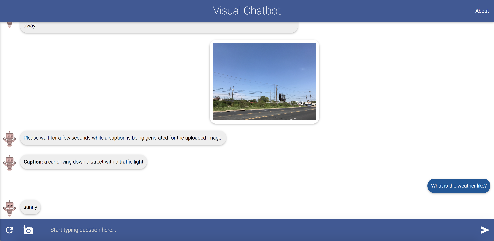

I have been very interested in the interplay between vision and natural language for some time. In these years, an emerging research topic combined these two areas. That is, visual question answering (VQA). Recently, I made a dive into this topic and wrote some notes as you are reading now.

## What is VQA?
VQA is a task that involves understanding the semantic information of both an image and a natuarl language question and returning the answer also expressed in natural language. You may play with the [Visual Chatbot](http://demo.visualdialog.org/) to get a sense of VQA.

 As can be seen, this is a multi-modal task involving two modes of data (an image and a text). To answer the question, both the semantics of the image and the question should be well understood.

## Importance of VQA
VQA is an important research topic, mainly for three reasons. The first is a historical one, kind of relevant to the origin of computer vision, a summer project at MIT back in 1966 [1]. Richard Szeliski wrote about this in his famous book [2]:

> in 1966, Marvin Minsky at MIT asked his undergraduate student Gerald Jay Sussman to spend the summer linking a camera to a computer and getting the computer to describe what it saw

This *see-and-describe* summarizes the original goal of the pioneers of computer vision: let the computer see the world around it (expressed in images) and describe it. In terms of this goal, a highly related task is image captioning, which I played with in [this post](https://jianchao-li.github.io/2018/08/08/playing-with-image-captioning.html). However, image captioning typically gives a general description of the image. If we would like the computer to describe some specific details, a natural way is to ask it to do so explicitly, which is what we do in VQA.

The second reason that accounts for the significance of VQA is its potential to become an *AI-complete* task [3]. Most tasks in artificial intelligence, especially computer vision, can be kind of boiled down to answering questions over images. For example, image classification is to answer a multiple-choice question of the category of an image.

The last but ont least reason is that VQA has many promising applications. The most evident one is human-computer interaction, which benefits from VQA since it teaches a computer both to see and to speak. In the future, a human may be able to talk to an intelligent agent about a scene in natural language. This can further find many applications like navigation for the blind people (asking the navigation agent about what it sees to help the blind people know where to go) and video processing (asking an VQA agent to find out someone or something of interests in a large number of surveillance videos).

## Breaking down VQA
Currently, researchers generally break the VQA problem down to four subproblems.

* **How to represent the image**

Convolutional neural newtorks (CNNs) have achieved great success in many image-related tasks. So many VQA pipelines make use of a pre-trained CNN to extract activations of specific layers as the image's bottom-up features. A relatively new idea is to use some detection networks, like Faster R-CNN, to extract bottom-up attention features, as in the state-of-the-art [4].

* **How to represent the question**

This subproblem is solved much better using LSTM, possibly with a concatenation with GloVe features.

* **How to combine the two representations**

There are several possibilities of combing the two representations of images and questions: concatenation, element-wise multiplication/summation and outer product. Outer product is preferred since it allows all elements of the two representations to interact with each other. But it comes with a high dimension and thus large memory consumption and long computation time. A good solution to this problem is compact bilinear coding [5], which projects the outer product to a lower dimensional space.

* **How to generate the answer**

There are mainly two ways: generating the answer using an RNN or by choosing it from a set of candidate answers as in classification. Most works use the classification approach, including the state-of-the-art [4].

## Bottlenecks of VQA
There are mainly two bottlenecks of the current VQA research. 

The first one is on the side of algorithms, specifically, the features of images/questions are computed in advance and then fed into the pipeline and fixed. This is kind of similar to the pre-deep-learning age of computer vision that researchers hand-engineered features (features were not learned end-to-end). It will be more preferable if the features can be learned by back-propagating answer errors to the input images and questions.

The second one is on the side of datasets, specifically, the lack of datasets that ask questions which require external knowledge to answer. Incorporating external knowledge (like common sense or those from the encyclopedia) into VQA will push it to be an AI-complete task [3].

## Thoughts about the bottlnecks

For the first bottleneck that features are not learned, one difficulty of learning those features for the image/question is that the pipeline includes some non-differentiable operations and thus back-propagation cannot be applied. An idea to overcome this difficulty is to use policy gradient [6].

For the second bottleneck, the idea is to first collect a dataset for it. And the main challenge lies in how to incorporate the external knowledge into VQA. An idea, proposed in [7], is to learn a mapping from the image and question to a query into the knowledge database and incorporate the results of the query into the pipeline.

## References

[1] S. Papert. The summer vision project. Technical Report Vision Memo. No. 100, Artificial Intelligence Group, Massachusetts Institute of Technology, 1966.

[2] R. Szeliski. Computer Vision: Algorithms and Applications. Springer, 2010. http://szeliski.org/Book/.

[3] Q. Wu, D. Teney, P. Wang, C. Shen, A. Dick, and A. v. d. Hengel. Visual question answering: A survey of methods and datasets. Computer Vision and Image Understanding, 2017.

[4] P. Anderson, X. He, C. Buehler, D. Teney, M. Johnson, S. Gould, and L. Zhang. Bottom-Up and Top-Down Attention for Image Captioning and Visual Question Answering. In Proceedings of the IEEE Conference on Computer Vision and Pattern Recognition, 2018.

[5] A. Fukui, D. H. Park and D. Yang, A. Rohrbach, T. Darrell, and M. Rohrbach. Multimodal Compact Bilinear Pooling for Visual Question Answering and Visual Grounding. CoRR abs/1606.01847, 2016.

[6] J. Johnson, B. Hariharan, L. v. d. Maaten, J. Hoffman, L. Fei-Fei, C. L. Zitnick, and R. Girshick. Inferring and Executing Programs for Visual Reasoning. In Proceedings of the International Conference on Computer Vision, 2017.

[7] P. Wang, Q. Wu, C. Shen, A. v. d. Hengel, A. Dick. FVQA: fact-based visual question answering. CoRR abs/1606.05433, 2016.