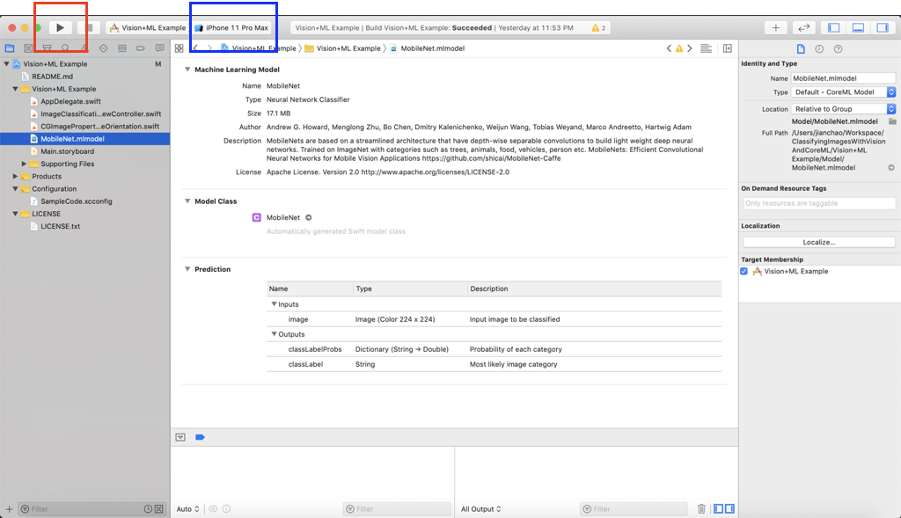
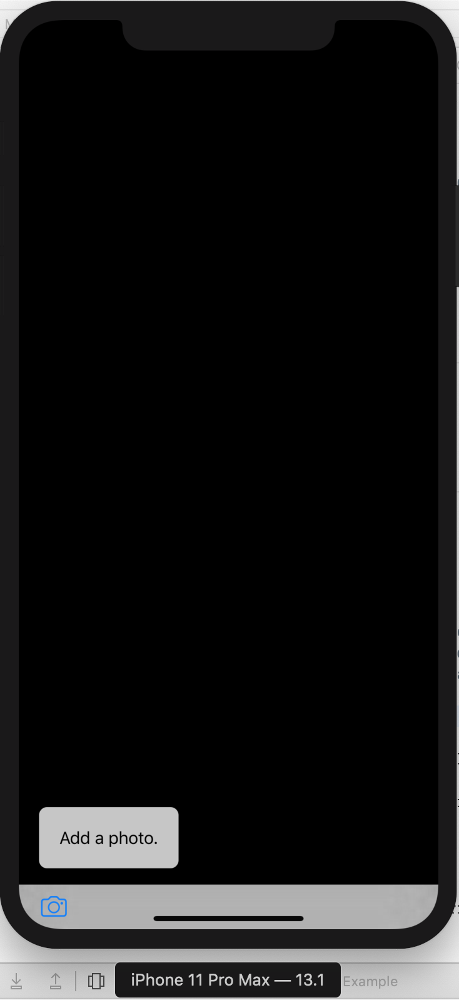
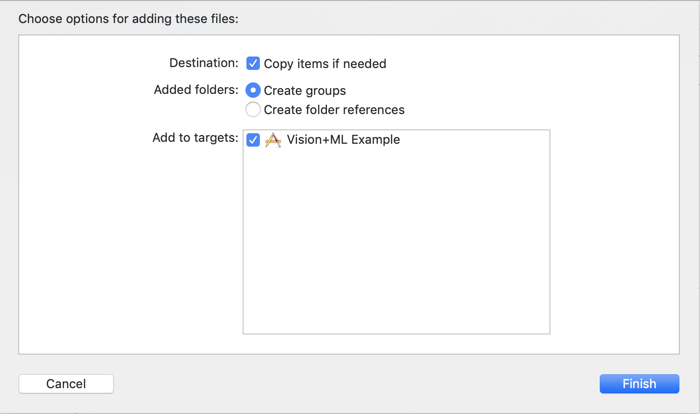
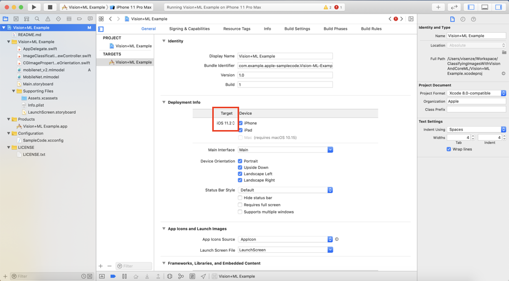

After working with PyTorch in my daily work for some time, recently I got a chance to work on something completely new - [Core ML](https://developer.apple.com/documentation/coreml). After converting a PyTorch model to the Core ML format and seeing it work in an iPhone 7, I believe this deserves a blog post.

## What is Core ML?
Core ML is a framework developed by Apple to integrate machine learning models into iOS applications. As like each other framework, Core ML has its own model format (`.mlmodel`), like `.pth` of PyTorch or `.params` of MXNet.

Compared to PyTorch or MXNet, Core ML is mainly used as an inference engine in iOS. That means you will first train a model using PyTorch (`.pth`) or MXNet (`.params`) and then convert it to the Core ML format (`.mlmodel`) and deploy it to an iOS app.

## Get a Sense First
Before diving into details, it is better to get a sense of what a Core ML model looks like. You may download the sample code in [Classifying Images with Vision and Core ML](https://developer.apple.com/documentation/vision/classifying_images_with_vision_and_core_ml). There is a `MobileNet.mlmodel` inside it. You can open it with Xcode to see what it looks like.

The following is a screenshot of the model details. In the center area, there are 3 sections: Machine Learning Model, Model Class and Prediction.

<div style="text-align:center"></div>

The interesting part is the Prediction. It tells us that the input to the model is a color (RGB) image of size 224 x 224 and the outputs have two parts: top-1 category `classLabel` and the probabilities of all categories `classLabelProbs`. **This will guide the model conversion later**.

Then ou can click the triangle in the following red rectangle to build the project. You can also select the device simulator that you want to run the project on in the blue rectangle. 

<div style="text-align:center"></div>

You may need to configure the "Signing & Capabilities" by clicking the `Vision+ML Example` folder (an Apple ID will be needed). After that, you should see an iPhone coming out in your screen and you can start to add a photo and play with it! If you want to try it on a real iPhone, just connect your iPhone to the computer (USB or Type-C) then you should be able to select your iPhone in the blue rectangle.

<div style="text-align:center"></div>

You can try more open source Core ML models [here](https://developer.apple.com/machine-learning/models/). To add a model to the project, you need to drag it to the project structure and set it up as follows. Some files will be generated automatically for you to use the model.

<div style="text-align:center"></div>

You need to change the line `let model = try VNCoreMLModel(for: MobileNet().model)` in `ImageClassificationViewController.swift` to use the model. You may also need to update the target iOS version shown in the red rectangle of the following screenshot.

<div style="text-align:center"></div>

## Model Conversion
Now we take a step back. We have just trained a model using PyTorch or MXNet and we wwant to run it on iOS. Obviously, we need to convert the `.pth` or `.params` to `.mlmodel`. This is model conversion.

For Caffe and Keras, their models can be converted to Core ML models directly. However, such direct conversion is not supported for PyTorch. Fortunately, we have [ONNX](https://onnx.ai/), an excellent exchange format between models of various frameworks.

The conversion flow from PyTorch to Core ML is as follows. I will use the `mobilenet_v2` of `torchvision` as an example to walk through the conversion process.

<div style="text-align:center"></div>

### Loading TorchVision Model
First I load a MobileNet v2 pretrained on ImageNet. Note that I add a Softmax layer to get the probabilities of all categories (remember by the output `classLabelProbs` of the Core ML model?).

```python
import torch
import torch.nn as nn
import torchvision

model = torchvision.models.mobilenet_v2(pretrained=True)
# torchvision models do not have softmax outputs
model = nn.Sequential(model, nn.Softmax())
```

### PyTorch to ONNX
Then I convert the above PyTorch model to onnx (`model.onnx`). Note that the `input_names` and `output_names` are consistent with the above Core ML model.

```python
dummy_input = torch.randn(1, 3, 224, 224)
torch.onnx.export(model, dummy_input, 'mobilenet_v2.onnx', verbose=True,
                  input_names=['image'], output_names=['classLabelProbs'])
```

### ONNX to Core ML
Finally, convert the ONNX model to a Core ML model (`mobilenet_v2.mlmodel`). In this process, the class labels of ImageNet is required, which can be dowloaded to `imagenet_class_index.json` from [here](https://s3.amazonaws.com/deep-learning-models/image-models/imagenet_class_index.json). The `image_input_names=['image']` means we treat the `image` (input of the onnx model) as an image (remember the input `image` of the above Core ML model?). `predicted_feature_name='classLabel'` will generate the other output of the above Core ML model.

```python
import json
import requests
from onnx_coreml import convert

IMAGENET_CLASS_INDEX_URL = 'https://s3.amazonaws.com/deep-learning-models/image-models/imagenet_class_index.json'

def load_imagenet_class_labels():
    response = requests.get(IMAGENET_CLASS_INDEX_URL)
    index_json = response.json()
    class_labels = [index_json[str(i)][1] for i in range(1000)]
    return class_labels

model_onnx = onnx.load('mobilenet_v2.onnx')
class_labels = load_imagenet_class_labels()
model_coreml = convert(model_onnx, mode='classifier', image_input_names=['image'],
	               class_labels=class_labels, predicted_feature_name='classLabel')
model_coreml.save('mobilenet_v2.mlmodel')
```

Now you can drag the `mobilenet_v2.mlmodel` to your project and play with it. Have fun!