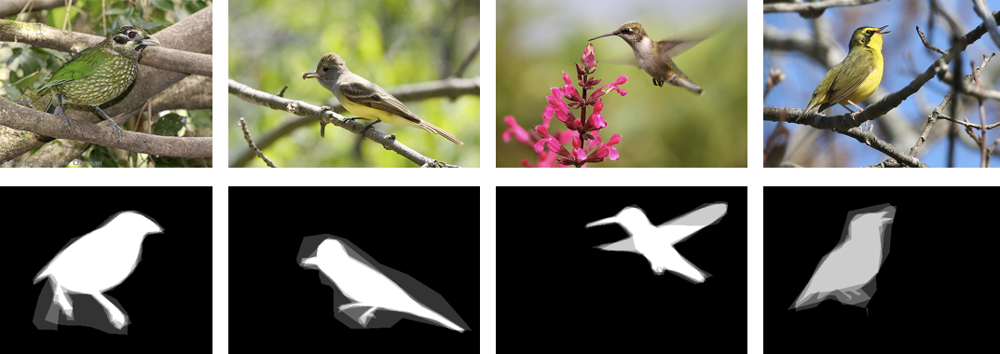
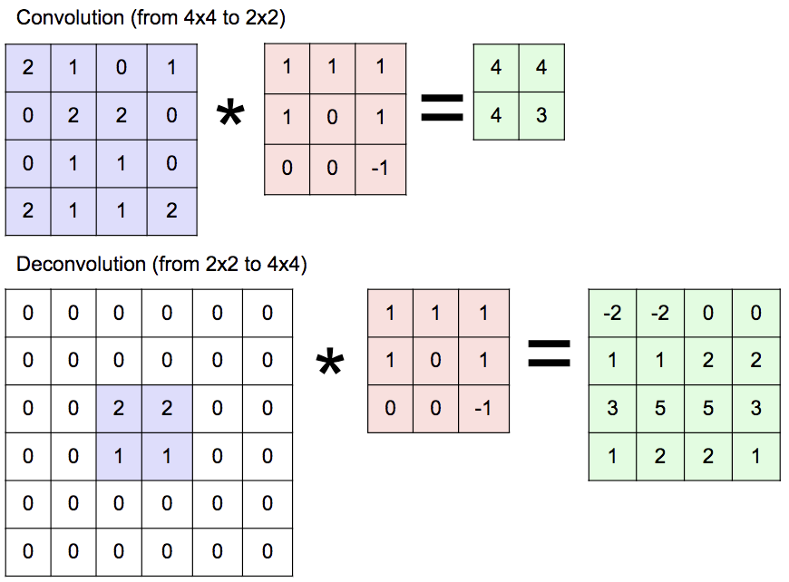

Fully convolutional networks, or FCNs, were proposed by [Jonathan Long](http://people.eecs.berkeley.edu/~jonlong/), [Evan Shelhamer](http://imaginarynumber.net/) and [Trevor Darrell](https://people.eecs.berkeley.edu/~trevor/) in CVPR 2015 as a framework for semantic segmentation.

## Semantic segmentation

Semantic segmentation is a task in which given an image, we need to assign a semantic label (like cat, dog, person, background etc.) to each of its pixels. The following are some examples taken from [The PASCAL VOC data sets](http://host.robots.ox.ac.uk/pascal/VOC/) with different colors representing different semantic classes.

<div style="text-align:center"></div>

The PASCAL VOC data sets define 20 semantic classes: aeroplane, bicycle, bird, boat, bottle, bus, car, cat, chair, cow, dining table, dog, horse, motorbike, person, potted plant, sheep, sofa, train, and tv/monitor. Actually these are all *object* classes. For pixels falling into non-object classes (which are called *stuff*) like sky, they will be labeled as "background".

Some later semantic segmentation data sets like [The Cityscapes Dataset](https://www.cityscapes-dataset.com/) and [The COCO-Stuff dataset](https://github.com/nightrome/cocostuff) account for both object and stuff classes. The following are some examples taken from the COCO-Stuff dataset, with class names also shown.

<div style="text-align:center"></div>

## How to use CNNs for segmentation

Back in 2015, convolutional neural networks (CNNs) have achieved tremendous success in image classification (like [AlexNet](https://www.nvidia.cn/content/tesla/pdf/machine-learning/imagenet-classification-with-deep-convolutional-nn.pdf) and [GoogLeNet](https://www.cs.unc.edu/~wliu/papers/GoogLeNet.pdf)), doing extremely well in learning from a fixed-size image to a single category label. Generally, the image will go through several convolutional layers and then fully connected layers, giving a fixed-size (equal to the number of classes) output, whose softmax loss with respect to the ground truth label will be computed and back-propagated to update parameters.

However, in semantic segmentation, we need pixel-wise dense predictions instead of just a single label. For example, for a 256x128 image, the segmentation mask is also of size 256x128. We need to use CNNs to generate a predicted mask and then compute the loss between it and the ground truth one.

I was working on object segmentation at the end of 2014. Object segmentation is arguably much simpler than semantic segmentation in that it only classifies the pixels into two classes: the backround and the foreground (a specific object, like pedestrian, horse, bird etc.). The following are some examples taken from [Caltech-UCSD Birds-200-2011](http://www.vision.caltech.edu/visipedia/CUB-200-2011.html) with the object masks shown below the images.

<div style="text-align:center"></div>

Since CNNs are good at handling fixed-size data, a simple idea is to fix both the sizes of the image and the object mask. Then we set the number of output units of the last fully connected layer to be equal to the number of mask elements.

For loss computation, since I was working on object segmentation with only two values (0 for background and 1 for foreground) in the mask, I simply adopted the Euclidean loss. This extremely simple idea achieved state-of-the-art results in some object segmentation datasets and was publised in ICIP 2015 entitled [Object segmentation with deep regression](http://ieeexplore.ieee.org/document/7351084/).

## Changing fully connected layers to convolutional layers

However, the above idea is just not elegant. It mechanically resizes the object mask to the designated size and flattens it into a vector as the regression target. For semantic segmentation, we will have one mask for each class. If we still would like to use the same idea, we need to flatten all the masks into vectors and concatenate them to be a giant vector for regression. For example, in PASCAL VOC, there are 21 classes. Suppose we set the mask size to be 64x64, then we need to regress a vector with 64x64x21=86016 elements using a fully connected layer. If the input to this layer is 512x14x14 (you will come across this size in the section of VGG), the weight matrix will have 512x14x14x86016=8631877632 (over 8.6 billion) elements! If represented using the 4-byte `float`, this matrix alone will occupy more than 34 gigabytes! Well, let's try to save some space of the parameters.

A common idea to avoid the large number of parameters consumed by fully connected layers is to use convolutional layers. For example, we may use a convolutional layer to generate a 21x64x64 output feature map (we no longer need to flatten the masks into vectors). In this way, we only need 21 convolutional kernels, which will use considerably fewer number of parameters. Actually, each of the 64x64 positions in the 21 maps represent the probabilities of that location being each of the 21 classes. So we may compute a softmax loss for each of the position and take an average over all the positions as the final loss. Semantic segmentation actually can be treated as a pixel-wise classification task. Therefore, computing a softmax loss makes more sense than using the Euclidean loss.

Let's summarize the above idea. Given an image, we resize it to be, say, 224x224. And we resize the segmentation masks (suppose there are 21 of them) to be 64x64. Then we carefully design a convolutional network to transform the 3x224x224 image (3 represents the R, G, B channels) to a 21x64x64 feature map and compute softmax loss over it with which we can use back-propagation to learn the network parameters.

I am not sure how you would perceive this idea. From my perspective, a natural question to task is, *why not just set the masks to be of the same size as the image*. Well, we can actually make this happen by using same padding in all the convolutional layers and discarding all the pooling layers.

However, CNNs typically include pooling layers to downsample the feature maps, which have shown the effectiveness in image classification and have become a must-do. So it is not a good idea to discard the pooling layers. Now, since pooling layers will reduce the size of feature maps, how can we enlarge them to be of the same size as the input image? In fully convolutional networks, the authors proposed to use *deconvolutional layers* to **upsample** the feature maps.

## Deconvolutional layers

Actually deconvolution is a bad name as suggested by [A guide to convolution arithmetic for deep learning](https://arxiv.org/abs/1603.07285) and it suggests to use *transpose convolution*. There are also other names for your choice: *upconvolution*, *fractionally strided convolution*, and *backward strided convolution*, as mentioned in [CS231n 2018 Lecture 11](http://cs231n.stanford.edu/slides/2018/cs231n_2018_lecture11.pdf).

In deep learning, deconvolution is just a convolution with the input size and output size swapped. In convolution, the relationship between the input size and the output size can be expressed as follows.

$H\_{out} = \frac{H\_{in} + 2P - K}{S} + 1 \tag{1}\label{eq1}$

$W\_{out} = \frac{W\_{in} + 2P - K}{S} + 1 \tag{2}\label{eq2}$

$H\_{out}$, $H\_{in}$, $W\_{out}$, $W\_{in}$, $P$, $K$, and $S$ represent the output height, input height, output width, input width, padding, kernel size and stride respectively. In this post, we assume that the same padding and stride is used in both the height and width dimensions.

For example, if you are convolving a 4x4 input ($H\_{in} = W\_{in} = 4$) with a 3x3 kernel ($K = 3$) with stride 1 ($S = 1$) and no padding ($P = 0$), you will get an output of size 2x2 ($\frac{4 + 2 \times 0 - 3}{1} + 1 = 2$). So this is a convolution that transforms a 4x4 input to a 2x2 output with a 3x3 convolutional kernel. 

Now, in deconvolution, we would like to transform a 2x2 input to a 4x4 output using the same 3x3 convolutional kernel. Since deconvolution is still convolution, equations $\eqref{eq1}$ and $\eqref{eq2}$ still hold. Suppose we also use stride 1, then we need to solve $4 = \frac{2 + 2P - 3}{1} + 1$, which gives $P = 2$. So the corresponding deconvolution is just a convolution of a 2x2 input with the same 3x3 kernel, stride 1, and padding 2.

<div style="text-align:center"></div>

Now let's look at the relationship between the input size and output size in deconvolution. As mentioned above, deconvolution is a convolution with swapped input size and output size. So we can derive the relationship just by swapping $H\_{in}$ with $H\_{out}$ and $W\_{in}$ with $W\_{out}$ in equations $\eqref{eq1}$ and $\eqref{eq2}$, which gives

$$H\_{in} = \frac{H\_{out} + 2P - K}{S} + 1 \tag{3}\label{eq3}$$

$$W\_{in} = \frac{W\_{out} + 2P - K}{S} + 1 \tag{4}\label{eq4}$$

By moving $H\_{out}$ and $W\_{out}$ to the left-hand side, we finally get 

$$H\_{out} = SH\_{in} + K - S - 2P \tag{5}\label{eq5}$$

$$W\_{out} = SW\_{in} + K - S - 2P \tag{6}\label{eq6}$$

Now you know how to design a deconvolutional layer to upsample an input size to a specific output size. With deconvolution, we can upsample downsampled feature maps back to the same size as the input image. I think deconvolution is indeed the key to FCNs. For more details of deconvolution, please refer to [A guide to convolution arithmetic for deep learning](https://arxiv.org/abs/1603.07285).

## VGG

Before introducing FCNs, I would like to talk about [VGG](https://arxiv.org/pdf/1409.1556.pdf), which is the backbone network for the FCN example that will be presented in the next section. It was used by [Karen Simonyan](http://www.robots.ox.ac.uk/~karen/) and [Andrew Zisserman](https://www.robots.ox.ac.uk/~az/) in ILSVRC 2015 and won the second-place in the image classification task.

Specifically, I will use the [16-layer VGG](https://gist.github.com/ksimonyan/211839e770f7b538e2d8#file-vgg_ilsvrc_16_layers_deploy-prototxt) as an example. The following table is a breakdown of the network layer by layer. Note that the stride and padding is 1 and 0 by default if not specified. And the last softmax layer for loss computation is ignored. By **Size**, we mean the shape of the output blobs, which is computed using equations $\eqref{eq1}$ and $\eqref{eq2}$.

| Name | Type | Params | Size |
| ---- | ---- | ------ | ----:|
| `data` | Data | | 3x224x224 |
| `conv1_1` | Convolution | 64 3x3 kernels, padding 1 | 64x224x224 |
| `relu1_1` | ReLU | | 64x224x224 |
| `conv1_2` | Convolution | 64 3x3 kernels, padding 1 | 64x224x224 |
| `relu1_2` | ReLU | | 64x224x224 |
| `pool1` | Pooling | max 2x2, stride 2 | 64x112x112 |
| `conv2_1` | Convolution | 128 3x3 kernels, padding 1 | 128x112x112 |
| `relu2_1` | ReLU | | 128x112x112 |
| `conv2_2` | Convolution | 128 3x3 kernels, padding 1 | 128x112x112 |
| `relu2_2` | ReLU | | 128x112x112 |
| `pool2` | Pooling | max 2x2, stride 2 | 128x56x56 |
| `conv3_1` | Convolution | 256 3x3 kernels, padding 1 | 256x56x56 |
| `relu3_1` | ReLU | | 256x56x56 |
| `conv3_2` | Convolution | 256 3x3 kernels, padding 1 | 256x56x56 |
| `relu3_2` | ReLU | | 256x56x56 |
| `conv3_3` | Convolution | 256 3x3 kernels, padding 1 | 256x56x56 |
| `relu3_3` | ReLU | | 256x56x56 |
| `pool3` | Pooling | max 2x2, stride 2 | 256x28x28 |
| `conv4_1` | Convolution | 512 3x3 kernels, padding 1 | 512x28x28 |
| `relu4_1` | ReLU | | 512x28x28 |
| `conv4_2` | Convolution | 512 3x3 kernels, padding 1 | 512x28x28 |
| `relu4_2` | ReLU | | 512x28x28 |
| `conv4_3` | Convolution | 512 3x3 kernels, padding 1 | 512x28x28 |
| `relu4_3` | ReLU | | 512x28x28 |
| `pool4` | Pooling | max 2x2, stride 2 | 512x14x14 |
| `conv5_1` | Convolution | 512 3x3 kernels, padding 1 | 512x14x14 |
| `relu5_1` | ReLU | | 512x14x14 |
| `conv5_2` | Convolution | 512 3x3 kernels, padding 1 | 512x14x14 |
| `relu5_2` | ReLU | | 512x14x14 |
| `conv5_3` | Convolution | 512 3x3 kernels, padding 1 | 512x14x14 |
| `relu5_3` | ReLU | | 512x14x14 |
| `pool5` | Pooling | max 2x2, stride 2 | 512x7x7 |
| `fc6` | InnerProduct | 25088x4096 weight, 1x4096 bias | 4096 |
| `relu6` | ReLU | | 4096 |
| `drop6` | Dropout | p=0.5 | 4096 |
| `fc7` | InnerProduct | 4096x4096 weight, 1x4096 bias | 4096 |
| `relu7` | ReLU | | 4096 |
| `drop7` | Dropout | p=0.5 | 4096 |
| `fc8` | InnerProduct | 4096x1000 weight, 1x1000 bias | 1000 |

As can be seen, VGG only uses 3x3 convolutional kernels and 2x2 pooling kernels with stride 2. This simple and homogeneous structure accounts for its popularity to some degree.

There is a nice visualization of the 16-layer VGG in [netscope](http://ethereon.github.io/netscope/#/preset/vgg-16). By hovering your mouse over the layers, you will be able to see their parameters and output shapes, which should be the same to those in the above table. The [CS231n 2018 Lecture 9](http://cs231n.stanford.edu/slides/2018/cs231n_2018_lecture09.pdf) also covers this popular network.

## Fully convolutional networks

Now you are ready to embrace the idea of FCNs. It is fairly simple: first downsample the image to smaller feature maps and then upsample them to the segmentation masks (of the same size as the image). [CS231n 2018 Lecture 11](http://cs231n.stanford.edu/slides/2018/cs231n_2018_lecture11.pdf) has the following nice illustration which summarizes this process. Actually I think the $D_3 \times H/4 \times W/4$ of Low-res should be $D_3 \times H/8 \times W/8$. Anyway, you can just ignore the captions. The picture has reflected the core idea.

<div style="text-align:center"></div>

To gain more understanding, let's walk through a concrete example - [voc-fcn32s](https://github.com/shelhamer/fcn.berkeleyvision.org/blob/master/voc-fcn32s/val.prototxt), an adaptation of the 16-layer VGG into an FCN for semantic segmentation in the PASCAL VOC data sets. Since this dataset has 21 classes, we need to learn 21 segmentation masks.

Let's also break the voc-fcn32s down layer by layer. Note that the size of `data` is now $3 \times H \times W$. In this way, we will show that FCN is able to handle input of any size! All default settings are the same to those in the above table.

| Name | Type | Params | Size |
| ---- | ---- | ------ | ----:|
| `data` | Data | | <span style="color:red">$3 \times H \times W$</span> |
| `conv1_1` | Convolution | 64 3x3 kernels, <span style="color:red">padding 100</span> | $64 \times \left(H + 198\right) \times \left(W + 198\right)$ |
| `relu1_1` | ReLU | | $64 \times \left(H + 198\right) \times \left(W + 198\right)$ |
| `conv1_2` | Convolution | 64 3x3 kernels, padding 1 | $64 \times \left(H + 198\right) \times \left(W + 198\right)$ |
| `relu1_2` | ReLU | | $64 \times \left(H + 198\right) \times \left(W + 198\right)$ |
| `pool1` | Pooling | max 2x2, stride 2 | $64 \times \left(\frac{H}{2} + 99\right) \times \left(\frac{W}{2} + 99\right)$ |
| `conv2_1` | Convolution | 128 3x3 kernels, padding 1 | $128 \times \left(\frac{H}{2} + 99\right) \times \left(\frac{W}{2} + 99\right)$ |
| `relu2_1` | ReLU | | $128 \times \left(\frac{H}{2} + 99\right) \times \left(\frac{W}{2} + 99\right)$ |
| `conv2_2` | Convolution | 128 3x3 kernels, padding 1 | $128 \times \left(\frac{H}{2} + 99\right) \times \left(\frac{W}{2} + 99\right)$ |
| `relu2_2` | ReLU | | $128 \times \left(\frac{H}{2} + 99\right) \times \left(\frac{W}{2} + 99\right)$ |
| `pool2` | Pooling | max 2x2, stride 2 | $128 \times \left(\frac{H + 2}{4} + 49\right) \times \left(\frac{W + 2}{4} + 49\right)$ |
| `conv3_1` | Convolution | 256 3x3 kernels, padding 1 | $256 \times \left(\frac{H + 2}{4} + 49\right) \times \left(\frac{W + 2}{4} + 49\right)$ |
| `relu3_1` | ReLU | | $256 \times \left(\frac{H + 2}{4} + 49\right) \times \left(\frac{W + 2}{4} + 49\right)$ |
| `conv3_2` | Convolution | 256 3x3 kernels, padding 1 | $256 \times \left(\frac{H + 2}{4} + 49\right) \times \left(\frac{W + 2}{4} + 49\right)$ |
| `relu3_2` | ReLU | | $256 \times \left(\frac{H + 2}{4} + 49\right) \times \left(\frac{W + 2}{4} + 49\right)$ |
| `conv3_3` | Convolution | 256 3x3 kernels, padding 1 | $256 \times \left(\frac{H + 2}{4} + 49\right) \times \left(\frac{W + 2}{4} + 49\right)$ |
| `relu3_3` | ReLU | | $256 \times \left(\frac{H + 2}{4} + 49\right) \times \left(\frac{W + 2}{4} + 49\right)$ |
| `pool3` | Pooling | max 2x2, stride 2 | $256 \times \left(\frac{H + 6}{8} + 24\right) \times \left(\frac{W + 6}{8} + 24\right)$ |
| `conv4_1` | Convolution | 512 3x3 kernels, padding 1 | $512 \times \left(\frac{H + 6}{8} + 24\right) \times \left(\frac{W + 6}{8} + 24\right)$ |
| `relu4_1` | ReLU | | $512 \times \left(\frac{H + 6}{8} + 24\right) \times \left(\frac{W + 6}{8} + 24\right)$ |
| `conv4_2` | Convolution | 512 3x3 kernels, padding 1 | $512 \times \left(\frac{H + 6}{8} + 24\right) \times \left(\frac{W + 6}{8} + 24\right)$ |
| `relu4_2` | ReLU | | $512 \times \left(\frac{H + 6}{8} + 24\right) \times \left(\frac{W + 6}{8} + 24\right)$ |
| `conv4_3` | Convolution | 512 3x3 kernels, padding 1 | $512 \times \left(\frac{H + 6}{8} + 24\right) \times \left(\frac{W + 6}{8} + 24\right)$ |
| `relu4_3` | ReLU | | $512 \times \left(\frac{H + 6}{8} + 24\right) \times \left(\frac{W + 6}{8} + 24\right)$ |
| `pool4` | Pooling | max 2x2, stride 2 | $512 \times \left(\frac{H + 6}{16} + 12\right) \times \left(\frac{W + 6}{16} + 12\right)$ |
| `conv5_1` | Convolution | 512 3x3 kernels, padding 1 | $512 \times \left(\frac{H + 6}{16} + 12\right) \times \left(\frac{W + 6}{16} + 12\right)$ |
| `relu5_1` | ReLU | | $512 \times \left(\frac{H + 6}{16} + 12\right) \times \left(\frac{W + 6}{16} + 12\right)$ |
| `conv5_2` | Convolution | 512 3x3 kernels, padding 1 | $512 \times \left(\frac{H + 6}{16} + 12\right) \times \left(\frac{W + 6}{16} + 12\right)$ |
| `relu5_2` | ReLU | | $512 \times \left(\frac{H + 6}{16} + 12\right) \times \left(\frac{W + 6}{16} + 12\right)$ |
| `conv5_3` | Convolution | 512 3x3 kernels, padding 1 | $512 \times \left(\frac{H + 6}{16} + 12\right) \times \left(\frac{W + 6}{16} + 12\right)$ |
| `relu5_3` | ReLU | | $512 \times \left(\frac{H + 6}{16} + 12\right) \times \left(\frac{W + 6}{16} + 12\right)$ |
| `pool5` | Pooling | max 2x2, stride 2 | $512 \times \left(\frac{H + 6}{32} + 6\right) \times \left(\frac{W + 6}{32} + 6\right)$ |
| `fc6` | <span style="color:red">Convolution</span> | 4096 7x7 kernels | $4096 \times \frac{H + 6}{32} \times \frac{W + 6}{32}$ |
| `relu6` | ReLU | | $4096 \times \frac{H + 6}{32} \times \frac{W + 6}{32}$ |
| `drop6` | Dropout | p=0.5 | $4096 \times \frac{H + 6}{32} \times \frac{W + 6}{32}$ |
| `fc7` | <span style="color:red">Convolution</span> | 4096 1x1 kernels | $4096 \times \frac{H + 6}{32} \times \frac{W + 6}{32}$ |
| `relu7` | ReLU | | $4096 \times \frac{H + 6}{32} \times \frac{W + 6}{32}$ |
| `drop7` | Dropout | | $4096 \times \frac{H + 6}{32} \times \frac{W + 6}{32}$ |
| `score_fr` | Convolution | 21 1x1 kernels | $21 \times \frac{H + 6}{32} \times \frac{W + 6}{32}$ |
| `upscore` | <span style="color:red">Deconvolution</span> | 21 64x64 kernels, stride 32 | <span style="color:red">$21 \times \left(H + 38\right) \times \left(W + 38\right)$</span> |
| `score` | <span style="color:red">Crop</span> | Explained below | $21 \times H \times W$|

Several interesting facts worth notice have been highlighted in red. Let's go over them one by one.

The most interesting and confusing one is probably the padding 100 in `conv1_1`. Why do FCNs use padding 100 instead of just 1 as does VGG? Well, let's try to use padding 1 and see what will happen. Using equations $\eqref{eq1}$ and $\eqref{eq2}$ repeatedly, we can compute that the corresponding output size of `pool5` will be $512 \times \frac{H}{32} \times \frac{W}{32}$.

So far so good. But now comes `fc6` with 4096 7x7 kernels. By plugging the variables into $\eqref{eq1}$ and $\eqref{eq2}$, the output size of `fc6` will be $4096 \times \frac{H - 192}{32} \times \frac{W - 192}{32}$. To make $\frac{H - 192}{32}$ and $\frac{W - 192}{32}$ positive (at least 1), both $H$ and $W$ should be greater than or equal to 224. This means that if we use padding 1 in `conv1_1`, the FCN will only be able to handle images not smaller than 224x224. However, we would like FCN to be able to handle input of any size, which is one of its main advantages. So we need to add more padding in `conv1_1` and 100 is a sensible value.

We also see that both `fc6` and `fc7` are now convolutional layers, fitting the name *fully convolutional networks*. In the deconvolutional layer `upscore`, the feature maps of `score_fr`with size $\frac{H + 6}{32}$x$\frac{W + 6}{32}$ are upsampled to $\left(H + 38\right) \times \left(W + 38\right)$. You may try to verify the correctness of this output size using equations $\eqref{eq5}$ and $\eqref{eq6}$.

After `upscore`, we have an output feature map of $21 \times \left(H + 38\right) \times \left(W + 38\right)$. However, what we want is $21 \times H \times W$. So here comes the last but not least Crop layer, which is used to *crop* the input and defined as follows in Caffe.

```protobuf
layer {
  name: "score"
  type: "Crop"
  bottom: "upscore"
  bottom: "data"
  top: "score"
  crop_param {
    axis: 2
    offset: 19
  }
}
```

This Crop layer accepts `upscore` ($21 \times \left(H + 38\right) \times \left(W + 38\right)$) and `data` ($3 \times H \times W$) from the two `bottom` fields. It also has two parameters: `axis: 2` and `offset: 19`. In Caffe, a feature map (blob) is of size $N \times C \times H \times W$, with $N$, $C$, $H$ and $W$ being the 0th, 1st, 2nd and 3rd dimension. So `upscore` and `data` are actually of size $N \times 21 \times \left(H + 38\right) \times \left(W + 38\right)$ and $N \times 3 \times H \times W$ respectively. `axis: 2` means to crop from the 2nd dimension (inclusive). So only the dimension $H$ and $W$ of `upscore` ($\left(H + 38\right) \times \left(W + 38\right)$) will be cropped to be the same as `data` ($H \times W$). And `offset: 19` specifies the starting index of the cropping, which means that `upscore` will be cropped to be `upscore[19: 19 + H, 19: 19 + W]`, literally the central part of `upscore`. The following is an illustration of this process, with the green part being the cropped region `score`.

<div style="text-align:center"></div>

## Simplifying FCN to a stack of convolutional layers

As shown in the above example, we use a Crop layer with `offset: 19` to crop the feature maps. This cropping layer comes into use since sometimes the deconvolutional (upsampling) layer may not precisely generate an $H \times W$ feature map. Instead, it may give us something like $\left(H + 2T\right) \times \left(W + 2T\right)$. In this case we need to determine the offset $T$ to do the cropping.

In the previous section, we break down the network layer by layer and write down the output shape for each layer, based on which we compute the offset of the Crop layer. In the coming sections, we will look at a general case and derive the offset.

In this section, we first simplify an FCN into a stack of $n$ convolutional layers, as shown below. This will make later derivation easier.

$$
\begin{align}
\overset{\text{Input}}{\longrightarrow}\fbox{conv-1}\longrightarrow\fbox{conv-2}\longrightarrow\dots\longrightarrow\fbox{conv-n}\overset{\text{Output}}{\longrightarrow}
\end{align}
$$

However, FCNs also have other layers like pooling layers, deconvolutional layers, or ReLU layers. So why do we only consider convolutional layers?

Well, if you have walked through the computation of the offset in voc-fcn32s, you will notice that the offset is only related to the size ($H$ and $W$) of the feature maps. And in FCNs, only convolutional layers, deconvolutional layers and pooling layers will change the feature map size. So we can safely ignore other layers like ReLU and Dropout.

For deconvolutional layers, they are just convolutional layers. So we only need to check pooling layers. For pooling layers, they are actually equivalent to convolutional layers regarding the size relationship between the input and output. Specifically, for pooling layers, equations $\eqref{eq1}$ and $\eqref{eq2}$ exactly hold true. For example, in `pool1`, we use 2x2 max pooling kernels ($K = 2$) with stride 2 ($S = 2$). And the default padding is 0 ($P = 0$). According to $\eqref{eq1}$ and $\eqref{eq2}$, we have

$$
\begin{equation}
\begin{aligned}
H\_{out} &= \frac{H\_{in} + 2 \times 0 - 2}{2} + 1 \\\\\\
&= \frac{H\_{in}}{2}
\end{aligned}
\end{equation}\tag{7}\label{eq7}
$$

and

$$
\begin{equation}
\begin{aligned}
W\_{out} &= \frac{W\_{in} + 2 \times 0 - 2}{2} + 1 \\\\\\
&= \frac{W\_{in}}{2}
\end{aligned}
\end{equation}\tag{8}\label{eq8}
$$

which match our expectation to downsample the input by a factor of 2.

So it makes sense to simplify an FCN to be a stack of convolutional layers since we only care about the size of the feature maps.

## Reparameterizing convolutional layers

Now, we only need to deal with convolutional layers. But, before diving into the derivation, let's further simplify it by reparameterizing convolution. Specifically, we rewrite equations $\eqref{eq1}$ and $\eqref{eq2}$ by moving $H\_{in}$ and $W\_{in}$ to the left-hand side.

$$
\begin{equation}
\begin{aligned}
H\_{in} &= S\left(H\_{out} - 1\right) + K - 2P \\\\\\
&= SH\_{out} + 2\left(\frac{K - S}{2} - P\right) \\\\\\
&= SH\_{out} + 2P^\prime
\end{aligned}
\end{equation}\tag{9}\label{eq9}
$$

$$
\begin{equation}
\begin{aligned}
W\_{in} &= S\left(W\_{out} - 1\right) + K - 2P \\\\\\
&= SW\_{out} + 2\left(\frac{K - S}{2} - P\right) \\\\\\
&= SW\_{out} + 2P^\prime
\end{aligned}
\end{equation}\tag{10}\label{eq10}
$$

As can be seen, we introduce a new parameter $P^\prime$ in equations $\eqref{eq9}$ and $\eqref{eq10}$, which is defined as follows.

$$P^\prime = \frac{K - S}{2} - P \tag{11}\label{eq11}$$

Given $P^\prime$, a convolutional layer with parameters $K$, $S$ and $P$ can be reparameterized by $S$ and $P^\prime$. $S$ still stands for the stride. And we name $P^\prime$ *offset*. Notice that $P^\prime$ is the offset of a convoltional layer, which is different from the aforementioned $T$, the offset of the FCN.

For pooling layers, equations $\eqref{eq9}$ and $\eqref{eq10}$ also apply to them exactly. For deconvolutional layers, we rewrite equations $\eqref{eq5}$ and $\eqref{eq6}$ by moving $H\_{out}$ and $W\_{out}$ to the left-hand side.

$$
\begin{equation}
\begin{aligned}
H\_{out} &= SH\_{in} + 2\left(\frac{K - S}{2} - P\right) \\\\\\
&= SH\_{in} + 2P^\prime
\end{aligned}
\end{equation}\tag{12}\label{eq12}
$$

$$
\begin{equation}
\begin{aligned}
W\_{out} &= SW\_{in} + 2\left(\frac{K - S}{2} - P\right) \\\\\\
&= SW\_{in} + 2P^\prime
\end{aligned}
\end{equation}\tag{13}\label{eq13}
$$

Since a deconvolutional layer is just a convolutional layer with its input size and output size swapped. Let's swap $H\_{out}$ with $H\_{in}$ and $W\_{out}$ with $W\_{in}$ in $\eqref{eq12}$ and $\eqref{eq13}$. Then we get the following convolutional layer expressed by equations $\eqref{eq14}$ and $\eqref{eq15}$.

$$H\_{in} = SH\_{out} + 2P^\prime \tag{14}\label{eq14}$$

$$W\_{in} = SW\_{out} + 2P^\prime \tag{15}\label{eq15}$$

Similarly, we move $H\_{out}$ and $W\_{out}$ to the left-hand side.

$$H\_{out} = \frac{1}{S}H\_{in} + 2\left(-\frac{P^\prime}{S}\right) \tag{16}\label{eq16}$$

$$W\_{out} = \frac{1}{S}W\_{in} + 2\left(-\frac{P^\prime}{S}\right) \tag{17}\label{eq17}$$

Note that equations $\eqref{eq12}$ and $\eqref{eq13}$ represent a deconvolutional layer with stride $S$ and offset $P^\prime$ while equations $\eqref{eq16}$ and $\eqref{eq17}$ represent a convolutional layer, whose stride and offset are $\frac{1}{S}$ and $-\frac{P^\prime}{S}$ respectively. 

Based on the above analysis, we can obtain the following theorem, which will come into use later.

> **Theorem** A deconvolution with stride $S$ and offset $P^\prime$ is equavilent to a convolution with stride $\frac{1}{S}$ and offset $-\frac{P^\prime}{S}$.

## Computing the offset

Based on the above reparameterization of convolutional layers, the simplified FCN stack of convolutional layers can be represented as follows.

$$
\begin{align}
\underset{H_0, W_0}{\overset{L_0}{\longrightarrow}}\underset{\text{conv-1}}{\boxed{S_1, P^\prime_1}}\underset{H_1, W_1}{\overset{L_1}{\longrightarrow}}\underset{\text{conv-2}}{\boxed{S_2, P^\prime_2}}\underset{H_2, W_2}{\overset{L_2}{\longrightarrow}}\dots\underset{H\_{n - 1}, W\_{n - 1}}{\overset{L\_{n - 1}}{\longrightarrow}}\underset{\text{conv-n}}{\boxed{S_n, P^\prime_n}}\underset{H_n, W_n}{\overset{L_n}{\longrightarrow}}
\end{align}
$$

The input to the network is denoted as $L_0$ and the output as $L_n$. For layer $L_i, i = 0, 1, 2, \dots, n$, its height, width, stride and offset are denoted as $H_i$, $W_i$, $S_i$ and $P^\prime_i$ respectively. Note that we ignore the $N$ and $C$ dimensions since the offset of FCN ($T$) is only related to $H$ and $W$. Let's further assume that $H_0 = W_0$ such that $H_i = W_i$ for all $i = 0, 1, 2, \dots, n$. Now we only need to consider a single dimension $H$.

Based on equations $\eqref{eq9}$ and $\eqref{eq10}$, we can write down

$$
\begin{equation}
\begin{aligned}
H_0 &= S_1H_1 + 2P^\prime_1 \\\\\\
H_1 &= S_2H_2 + 2P^\prime_2 \\\\\\
&\dots \\\\\\
H\_{n - 1} &= S_nH_n + 2P^\prime_n
\end{aligned}
\end{equation}\tag{18}\label{eq18}
$$

If we plug in the expression of $H_i$ into that of $H\_{i - 1}$, we can get

$$
\begin{equation}
\begin{aligned}
H_0 &= S_1H_1 + 2P^\prime_1\\\\\\
&= S_1\left(S_2H_2 + 2P^\prime_2\right) + 2P^\prime_1 \\\\\\
&= \left(S_1S_2\right)H_2 + 2\left(S_1P^\prime_2 + P^\prime_1\right) \\\\\\
&= \left(S_1S_2\right)\left(S_3H_3 + 2P^\prime_3\right) + 2\left(S_1P^\prime_2 + P^\prime_1\right) \\\\\\
&= \left(S_1S_2S_3\right)H_3 + 2\left(S_1S_2P^\prime_3 + S_1P^\prime_2 + P^\prime_1\right) \\\\\\
&= \dots
\end{aligned}
\end{equation}\tag{19}\label{eq19}
$$

Have you noticed the regularities? If you move on, you will end up with

$$
H_0 = \left(S_1S_2 \dots S_n\right)H_n + 2\left(S_1S_2 \dots S\_{n - 1}P^\prime_n + S_1S_2 \dots S\_{n - 2}P^\prime\_{n - 1} + \dots + S_1S_2P^\prime_3 + S_1P^\prime_2 + P^\prime_1\right) \tag{20}\label{eq20}$$

According to the definition of $T$, we have

$$H_n = H_0 + 2T \tag{21}\label{eq21}$$

By plugging equation $\eqref{eq21}$ into equation $\eqref{eq20}$, we have

$$
\begin{equation}
\begin{aligned}
H_0 &= \left(S_1S_2 \dots S_n\right)\left(H_0 + 2T\right) + 2\left(S_1S_2 \dots S\_{n - 1}P^\prime_n + S_1S_2 \dots S\_{n - 2}P^\prime\_{n - 1} + \dots + S_1S_2P^\prime_3 + S_1P^\prime_2 + P^\prime_1\right) \\\\\\
&= \left(S_1S_2 \dots S_n\right)H_0 + 2\left(S_1S_2 \dots S_n\right)T + 2\left(S_1S_2 \dots S\_{n - 1}P^\prime_n + S_1S_2 \dots S\_{n - 2}P^\prime\_{n - 1} + \dots + S_1S_2P^\prime_3 + S_1P^\prime_2 + P^\prime_1\right)
\end{aligned}
\end{equation}\tag{22}\label{eq22}
$$

Typically we design the network to make $S_1S_2 \dots S_n = 1$. Let's take voc-fcn8s as an example to verify this point. In this network, we have the following general convolutional layers (both pooling and deconvolutional layers are also counted as convolutional layers).

| Name | Type | Old parameterization ($K, S, P$) | Reparameterization ($S, P^\prime$) |
| ---- | ---- | --------------: | ------------------------------: |
| `conv1_1` | Convolution | $K_1 = 3, S_1 = 1, P_1 = 100$ | $S_1 = 1, P^\prime_1 = -99$ |
| `conv1_2` | Convolution | $K_2 = 3, S_2= 1, P_2 = 1$ | \$S_2 = 1, P^\prime_2 = 0$ |
| `pool1` | Pooling | $K_3 = 2, S_3 = 2, P_3 = 0$ | $S_3 = 2, P^\prime_3 = 0$ |
| `conv2_1` | Convolution | $K_4 = 3, S_4 = 1, P_4 = 1$ | $S_4 = 1, P^\prime_4 = 0$ |
| `conv2_2` | Convolution | $K_5 = 3, S_5 = 1, P_5 = 1$ | $S_5 = 1, P^\prime_5 = 0$ |
| `pool2` | Pooling | $K_6 = 2, S_6 = 2, P_6 = 0$ | $S_6 = 2, P^\prime_6 = 0$ |
| `conv3_1` | Convolution | $K_7 = 3, S_7 = 1, P_7 = 1$ | $S_7 = 1, P^\prime_7 = 0$ |
| `conv3_2` | Convolution | $K_8 = 3, S_8 = 1, P_8 = 1$ | $S_8 = 1, P^\prime_8 = 0$ |
| `conv3_3` | Convolution | $K_9 = 3, S_9 = 1, P_9 = 1$ | $S_9 = 1, P^\prime_9 = 0$ |
| `pool3` | Pooling | $K\_{10} = 2, S\_{10} = 2, P\_{10} = 0$ | $S\_{10} = 2, P^\prime\_{10} = 0$ |
| `conv4_1` | Convolution | $K\_{11} = 3, S\_{11} = 1, P\_{11} = 1$ | $S\_{11} = 1, P^\prime\_{11} = 0$ |
| `conv4_2` | Convolution | $K\_{12} = 3, S\_{12} = 1, P\_{12} = 1$ | $S\_{12} = 1, P^\prime\_{12} = 0$ |
| `conv4_3` | Convolution | $K\_{13} = 3, S\_{13} = 1, P\_{13} = 1$ | $S\_{13} = 1, P^\prime\_{13} = 0$ |
| `pool4` | Pooling | $K\_{14} = 2, S\_{14} = 2, P\_{14} = 0$ | $S\_{14} = 2, , P^\prime\_{14} = 0$ |
| `conv5_1` | Convolution | $K\_{15} = 3, S\_{15} = 1, P\_{15} = 1$ | $S\_{15} = 1, P^\prime\_{15} = 0$ |
| `conv5_2` | Convolution | $K\_{16} = 3, S\_{16} = 1, P\_{16} = 1$ | $S\_{16} = 1, P^\prime\_{16} = 0$ |
| `conv5_3` | Convolution | $K\_{17} = 3, S\_{17} = 1, P\_{17} = 1$ | $S\_{17} = 1, P^\prime\_{17} = 0$ |
| `pool5` | Pooling | $K\_{18} = 2, S\_{18} = 2, P\_{18} = 0$ | $S\_{18} = 2, P^\prime\_{18} = 0$ |
| `fc6` | Convolution | $K\_{19} = 7, S\_{19} = 1, P\_{19} = 0$ | $S\_{19} = 1, P^\prime\_{19} = 3$ |
| `fc7` | Convolution | $K\_{20} = 1, S\_{20} = 1, P\_{20} = 0$ | $S\_{20} = 1, P^\prime\_{20} = 0$ |
| `score_fr` | Convolution | $K\_{21} = 1, S\_{21} = 1, P\_{21} = 0$ | $S\_{21} = 1, P^\prime\_{21} = 0$ |
| `upscore` | Deconvolution | $K\_{22} = 64, S\_{22} = 32, P\_{22} = 0$ | $S\_{22} = \frac{1}{32}, P^\prime\_{22} = -\frac{1}{2}$ |

For `upscore`, it is a deconvolutional layer and so we make use of **Theorem** to compute its reparameterization parameters. Multiplying the above $S_1S_2 \dots S\_{22}$ will give us $2 ^ 5 \times 1 ^ {16} \times \frac{1}{32} = 1$.

Given $S_1S_2 \dots S_n = 1$, equation $\eqref{eq22}$ will be simplified into

$$H_0 = H_0 + 2T + 2\left(S_1S_2 \dots S\_{n - 1}P^\prime_n + S_1S_2 \dots S\_{n - 2}P^\prime\_{n - 1} + \dots + S_1S_2P^\prime_3 + S_1P^\prime_2 + P^\prime_1\right) \tag{23}\label{eq23}$$

Now we can derive the equation for computing the offset $T$.

$$T=-\left(S_1S_2 \dots S\_{n - 1}P^\prime_n + S_1S_2 \dots S\_{n - 2}P^\prime\_{n - 1} + \dots + S_1S_2P^\prime_3 + S_1P^\prime_2 + P^\prime_1\right) \tag{24}\label{eq24}$$

I computed $T$ for voc-fcn32s using the following Python codes according to equation $\eqref{eq24}$ and the result is 19.0, which is exactly the offset of the Crop layer.

```python
>>> S = [1, 1, 2, 1, 1, 2, 1, 1, 1, 2, 1, 1, 1, 2, 1, 1, 1, 2, 1, 1, 1, 1]
>>> P = [-99, 0, 0, 0, 0, 0, 0, 0, 0, 0, 0, 0, 0, 0, 0, 0, 0, 0, 3, 0, 0, -0.5]
>>> N = 22
>>> sum = 0
>>> for i in range(N):
...     prod = p[i]
...     for j in range(i):
...         prod *= s[j]
...     sum += prod
...
>>> T = -sum
>>> print(T)
19.0
```

## How MXNet computes the offset

Now you know one way to compute $T$. I would like to tell you one more, which is used in [MXNet](https://github.com/apache/incubator-mxnet/blob/master/example/fcn-xs/symbol_fcnxs.py).

From equation $\eqref{eq19}$, we can write down the equations of $H_0$ expressed in $H_i$ for all $i = 1, 2, \dots, n$.

$$
\begin{align}
H_0 &= S_1H_1 + 2P^\prime_1 \tag{25}\label{eq25} \\\\\\
H_0 &= \left(S_1S_2\right)H_2 + 2\left(S_1P^\prime_2 + P^\prime_1\right) \tag{26}\label{eq26} \\\\\\
H_0 &= \left(S_1S_2S_3\right)H_3 + 2\left(S_1S_2P^\prime_3 + S_1P^\prime_2 + P^\prime_1\right) \tag{27}\label{eq27} \\\\\\
&\dots \\\\\\
H_0 &= \left(S_1S_2 \dots S_n\right)H_n + 2\left(S_1S_2 \dots S\_{n - 1}P^\prime_n + S_1S_2 \dots S\_{n - 2}P^\prime\_{n - 1} + \dots + S_1S_2P^\prime_3 + S_1P^\prime_2 + P^\prime_1\right) \tag{28}\label{eq28}
\end{align}
$$

As aforementioned, eqution $\eqref{eq25}$ is a reparameterization of the convolutional layer conv-1 connecting $L_0$ and $L_1$. Obviously, equations $\eqref{eq26}$ to $\eqref{eq28}$ all have a similar form. We can actually treat them as a *compound convolutional layer* connecting $L_0$ and $L_2, L_3, \dots, L_n$. Let's call the compound convolutional layer connecting $L_0$ and $L_i \left(i = 1, 2, \dots, n\right)$ the $i$-th compound convolutional layer, whose compound stride $S_i^{\text{compound}}$ and compound offset $P_i^{\text{compound}}$ are as follows.

$$
\begin{equation}
\begin{aligned}
\left(S_1^{\text{compound}}, P_1^{\text{compound}}\right) &= \left(S_1, P^\prime_1\right) \\\\\\
\left(S_2^{\text{compound}}, P_2^{\text{compound}}\right) &= \left(S_1S_2, S_1P^\prime_2 + P^\prime_1\right) \\\\\\
\left(S_3^{\text{compound}}, P_3^{\text{compound}}\right) &= \left(S_1S_2S_3, S_1S_2P^\prime_3 + S_1P^\prime_2 + P^\prime_1\right) \\\\\\
&\dots \\\\\\
\left(S_n^{\text{compound}}, P_n^{\text{compound}}\right) &= \left(S_1S_2 \dots S_n, S_1S_2 \dots S\_{n - 1}P^\prime_n + S_1S_2 \dots S\_{n - 2}P^\prime\_{n - 1} + \dots + S_1S_2P^\prime_3 + S_1P^\prime_2 + P^\prime_1\right)
\end{aligned}
\end{equation}\tag{29}\label{eq29}
$$

As you may have noticed, $P_n^{\text{compound}}$ is just $-T$. If we can compute $P_n^{\text{compound}}$, then we know the value of $T$. 

Since $H_0 = 1 \cdot H_0 + 0$, let's introduce two auxiliary variables $\left(S_0^{\text{compound}}, P_0^{\text{compound}}\right) = \left(1, 0\right)$.

Now the problem is: given $\left(S_1, P^\prime_1\right), \left(S_2, P^\prime_2\right), \dots, \left(S_n, P^\prime_n\right)$ and $\left(S_0^{\text{compound}}, P_0^{\text{compound}}\right)$, how to compute $\left(S_i^{\text{compound}}, P_i^{\text{compound}}\right)$ for $i = 1, 2, \dots, n$.

This problem can be further reduced to: given $\left(S\_{i - 1}^{\text{compound}}, P\_{i - 1}^{\text{compound}}\right)$ and $\left(S_i, P^\prime_i\right)$, how to compute $\left(S\_{i}^{\text{compound}}, P\_{i}^{\text{compound}}\right)$ for $i = 1, 2, \dots, n$.

According to the expressions of $S\_{i}^{\text{compound}}$ and $P\_{i}^{\text{compound}}$, we have

$$
\begin{equation}
\begin{aligned}
S\_{i}^{\text{compound}} &= S_1S_2 \dots S_i \\\\\\
&= \underbrace{S_1S_2 \dots S\_{i - 1}}\_{S\_{i - 1}^{\text{compound}}}S_i \\\\\\
&= S\_{i - 1}^{\text{compound}}S_i
\end{aligned}
\end{equation}\tag{30}\label{eq30}
$$

$$
\begin{equation}
\begin{aligned}
P\_{i}^{\text{compound}} &= S_1S_2 \dots S\_{i - 1}P^\prime_i + S_1S_2 \dots S\_{i - 2}P^\prime\_{i - 1} + \dots + S_1S_2P^\prime_3 + S_1P^\prime_2 + P^\prime_1 \\\\\\
&= \underbrace{S_1S_2 \dots S\_{i - 1}}\_{S\_{i - 1}^{\text{compound}}}P^\prime_i + \underbrace{S_1S_2 \dots S\_{i - 2}P^\prime\_{i - 1} + \dots + S_1S_2P^\prime_3 + S_1P^\prime_2 + P^\prime_1}\_{P\_{i - 1}^{\text{compound}}} \\\\\\
&= S\_{i - 1}^{\text{compound}}P^\prime_i + P\_{i - 1}^{\text{compound}}
\end{aligned}
\end{equation}\tag{31}\label{eq31}
$$

Equations $\eqref{eq30}$ and $\eqref{eq31}$ are actually how [MXNet](https://github.com/apache/incubator-mxnet/blob/master/example/fcn-xs/symbol_fcnxs.py) compute the compound stride and compound offset. Let's dive into the codes to see how it is implemented.

In function `filter_map`, a convolution with parameters $K$ (`kernel`), $S$ (`stride`) and $P$ (`pad`) is reparameterized to $S$ (`stride`) and $P^\prime_i$. `(kernel-stride)/2-pad` is just $P^\prime_i$ according to equation $\eqref{eq11}$.

```python
def filter_map(kernel=1, stride=1, pad=0):
    return (stride, (kernel-stride)/2-pad)
```

In function `inv_fp`, a deconvolutional layer is transformed to an equivalent convolutional layer according to **Theorem**. `fp_in` just stores $\left(S, P^\prime\right)$.

```python
def inv_fp(fp_in):
    return (1.0/fp_in[0], -1.0*fp_in[1]/fp_in[0])
```

In `compose_fp`, equations $\eqref{eq30}$ and $\eqref{eq31}$ are implemented. `fp_first` represents $\left(S\_{i - 1}^{\text{compound}}, P\_{i - 1}^{\text{compound}}\right)$ and `fp_second` represents $\left(S_i, P^\prime_i\right)$. The returned result is $\left(S_i^{\text{compound}}, P_i^{\text{compound}}\right)$.

```python
def compose_fp(fp_first, fp_second):
    return (fp_first[0]*fp_second[0], fp_first[0]*fp_second[1]+fp_first[1])
```

Finally, in `compose_fp_list`, $\left(S\_{n}^{\text{compound}}, P\_{n}^{\text{compound}}\right)$ are computed iteratively using $\left(S_1, P^\prime_1\right), \left(S_2, P^\prime_2\right), \dots, \left(S_n, P^\prime_n\right)$ (stored in `fp_list`) and $\left(S_0^{\text{compound}}, P_0^{\text{compound}}\right)$ (`fp_out`) by repeatedly calling `compose_fp`. You may convince yourself of this point by manually running several steps of the `for` loop.

```python
def compose_fp_list(fp_list):
    fp_out = (1.0, 0.0)
    for fp in fp_list:
        fp_out = compose_fp(fp_out, fp)
    return fp_out
````

## Finer Details

In the `upscore` layer of voc-fcn32s, the feature maps are directly upsampled by a large factor of 32 (this is why it is named voc-fcn32s), which will produce relatively coarse predictions due to missing finer detils from intermediate resolutions. So, in [voc-fcn16s](https://github.com/shelhamer/fcn.berkeleyvision.org/blob/master/voc-fcn16s/val.prototxt) and [voc-fcn8s](https://github.com/shelhamer/fcn.berkeleyvision.org/blob/master/voc-fcn8s/val.prototxt), the shrinked feature maps are upsampled more than once before being recovered to the size of the image.

For [voc-fcn16s](https://github.com/shelhamer/fcn.berkeleyvision.org/blob/master/voc-fcn16s/val.prototxt), the feature maps from `score_fr` will first be upsampled by a factor of 2 in `upscore2`. Then, we generate another set of outputs from `pool4` using convolution in `score_pool4` and crop it to be the same size as that of `upscore2` in `score_pool4c`. Finally, we combine `upscore2` and `score_pool4c` using element-wise summation in `fuse_pool4`, upsample it by a factor of 16 in `upscore16` and crop it in `score` to obtain the output. We show the network architecture for this process while omitting the previous layers in the following figure. Moreover, this process is broken down in the table below.

<div style="text-align:center"></div>

| Name | Type | Params | Size |
| ---- | ---- | ------ | ----:|
| `pool4` | Pooling | max 2x2, stride 2 | $512 \times \left(\frac{H + 6}{16} + 12\right) \times \left(\frac{W + 6}{16} + 12\right)$ |
| `score_pool4` | Convolution | 21 1x1 kernels | $21 \times \left(\frac{H + 6}{16} + 12\right) \times \left(\frac{W + 6}{16} + 12\right)$ |
| `score_fr` | Convolution | 21 1x1 kernels | $21 \times \frac{H + 6}{32} \times \frac{W + 6}{32}$ |
| `upscore2` | Deconvolution | 21 4x4 kernels, stride 2 | $21 \times \left(\frac{H + 6}{16} + 2\right) \times \left(\frac{W + 6}{16} + 2\right)$ |
| `score_pool4c` | Crop | axis 2, offset 5 | $21 \times \left(\frac{H + 6}{16} + 2\right) \times \left(\frac{W + 6}{16} + 2\right)$|
| `fuse_pool4` | Eltwise | sum | $21 \times \left(\frac{H + 6}{16} + 2\right) \times \left(\frac{W + 6}{16} + 2\right)$ | 
| `upscore16` |  Deconvolution | 21 32x32 kernels, stride 16 | $21 \times \left(H + 54\right) \times \left(W + 54\right)$ |
| `score` | Crop | axis 2, offset 27 | $21 \times H \times W$|

As can be seen, the finer details from the intermediate resolution in `pool4` are incorporated into later feature maps, which will produce finer outputs than those of fcn-voc32s. Actually, fcn-voc16s utilizes two resolutions of a factor of 16 and a factor of 32.

We may combine more resolutions in the same way. In fcn-voc8s, we generate one more set of outputs from `pool3` and combine it with later feature maps. The network architecture is similarly shown in the figure below with the process broken down in the following table.

<div style="text-align:center"></div>

| Name | Type | Params | Size |
| ---- | ---- | ------ | ----:|
| `pool3` | Pooling | max 2x2, stride 2 | $256 \times \left(\frac{H + 6}{8} + 24\right) \times \left(\frac{W + 6}{8} + 24\right)$ |
| `score_pool3` | Convolution | 21 1x1 kernels | $21 \times \left(\frac{H + 6}{8} + 24\right) \times \left(\frac{W + 6}{8} + 24\right)$ |
| `pool4` | Pooling | max 2x2, stride 2 | $512 \times \left(\frac{H + 6}{16} + 12\right) \times \left(\frac{W + 6}{16} + 12\right)$ |
| `score_pool4` | Convolution | 21 1x1 kernels | $21 \times \left(\frac{H + 6}{16} + 12\right) \times \left(\frac{W + 6}{16} + 12\right)$ |
| `score_fr` | Convolution | 21 1x1 kernels | $21 \times \frac{H + 6}{32} \times \frac{W + 6}{32}$ |
| `upscore2` | Deconvolution | 21 4x4 kernels, stride 2 | $21 \times \left(\frac{H + 6}{16} + 2\right) \times \left(\frac{W + 6}{16} + 2\right)$ |
| `score_pool4c` | Crop | axis 2, offset 5 | $21 \times \left(\frac{H + 6}{16} + 2\right) \times \left(\frac{W + 6}{16} + 2\right)$|
| `fuse_pool4` | Eltwise | sum | $21 \times \left(\frac{H + 6}{16} + 2\right) \times \left(\frac{W + 6}{16} + 2\right)$ | 
| `upscore_pool4` |  Deconvolution | 21 4x4 kernels, stride 2 | $21 \times \left(\frac{H + 6}{8} + 6\right) \times \left(\frac{W + 6}{8} + 6\right)$ |
| `score_pool3c` | Crop | axis 2, offset 9 | $21 \times \left(\frac{H + 6}{8} + 6\right) \times \left(\frac{W + 6}{8} + 6\right)$ |
| `fuse_pool3` | Eltwise | sum | $21 \times \left(\frac{H + 6}{8} + 6\right) \times \left(\frac{W + 6}{8} + 6\right)$ |
| `upscore8` | Deconvolution | 21 16x16 kernels, stride 8 | $21 \times \left(H + 62\right) \times \left(W + 62\right)$ |
| `score` | Crop | axis 2, offset 31 | $21 \times H \times W$|

In fcn-voc8s, one more intermediate resolution `pool3` are incorpoeated. From fcn-voc32s, fcn-voc16s to fcn-voc8s, more intermediate resolutions are incorporated and the results will contain more details, as shown below (taken from the [FCN paper](https://arxiv.org/pdf/1411.4038.pdf)).

<div style="text-align:center"></div>

## Conclusion
We cover fully convolutional networks in great detail. To summarize, we have learend:

* Semantic segmentation requires dense pixel-level classification while image classification is only in image-level. 
* Fully convolutional networks (FCNs) are a general framework to solve semantic segmentation.
* The key to generate outputs with the same size as the input in FCNs is to use deconvolution layers, which are just convolutional layers with input and output swapped.
* The offset parameter in the Crop layers of FCNs can be computed by breaking down the network layer by layer or using an analytic equation.
* Outputs with higher resolutions from intermediate layers of the network can be incorporated to enhance the details in the segmentation results.