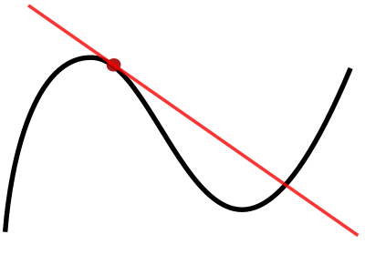
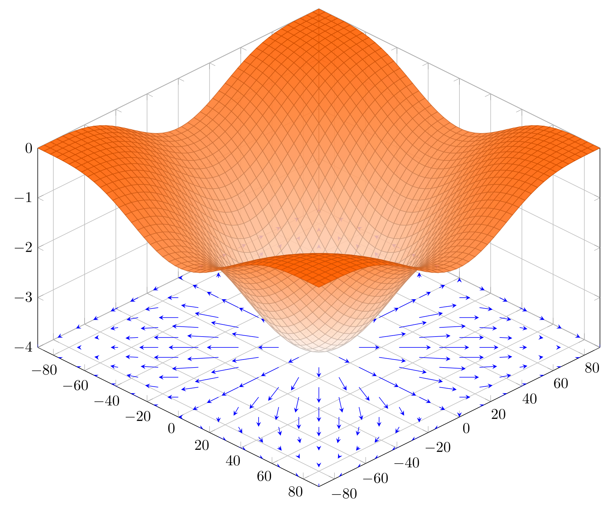
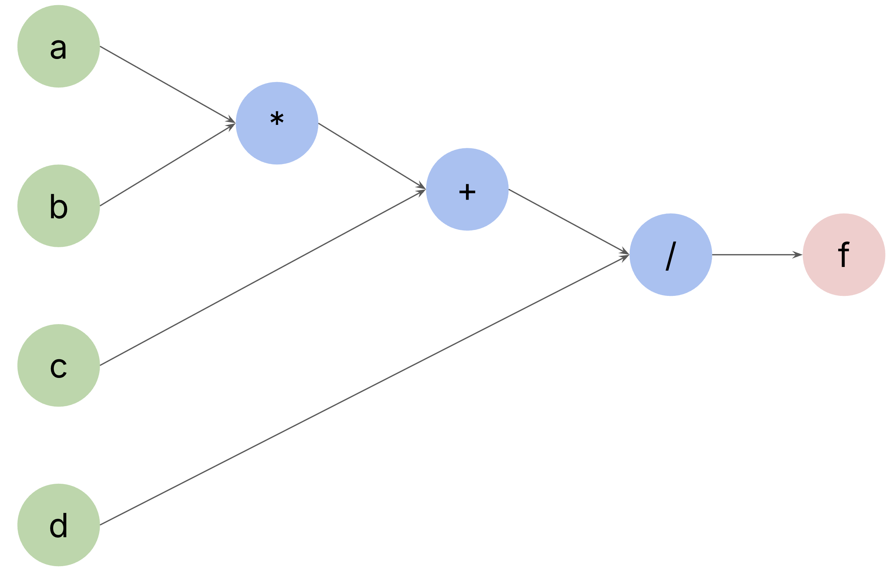
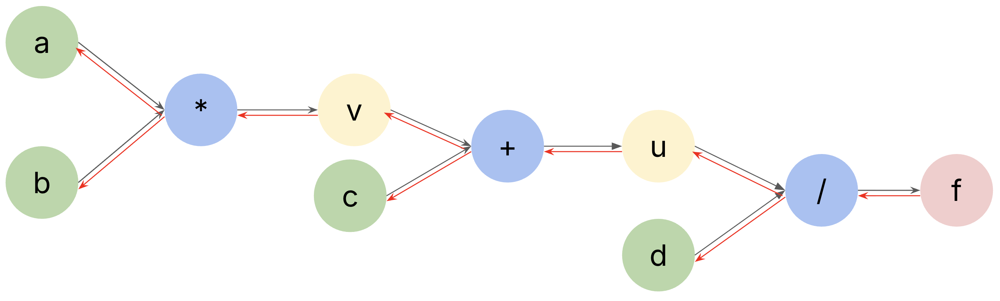
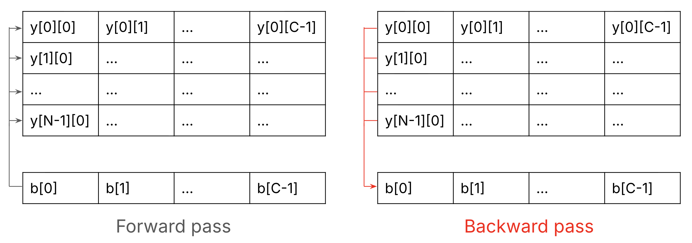
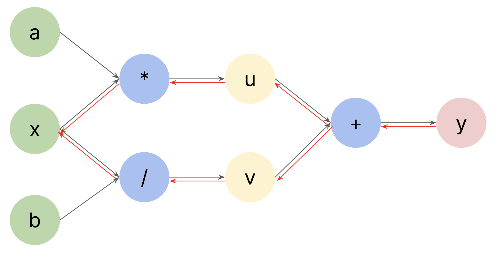



[Backpropagation](https://en.wikipedia.org/wiki/Backpropagation) (or "backprop" for short) is the algorithm that powers the training of most AI models. Nowadays, most deep learning libraries (e.g., [PyTorch](https://pytorch.org/)) come with support for automatic differentiation, i.e., backprop has been implemented for you. So you usually don't have to worry about backprop.

However, I believe it is still useful to understand backprop, and Andrej Karpathy would [agree](https://karpathy.medium.com/yes-you-should-understand-backprop-e2f06eab496b) with me :) The most important reason is that it is "the elephant in the room". For any serious practitioner in AI, it is hard to simply treat it like a black box. Moreover, I think it is also intellectually challenging and fun to understand it, implement it, and see it work for yourself.

# What is backprop

Backprop is a gradient computation method. So, what is gradient? Loosely speaking, gradient is the high-dimensional generalization of "derivative". For example, for a 1D function \(f\), its derivative at \(x\) measures the speed of change of \(f\) with respect to \(x\), i.e., how much \(f\) changes when \(x\) changes by a *tiny amount*. And in 1D case, derivative is simply the slope of the tangent line at \(x\), as in Figure 1.



**Figure 1.** A function drawn in black, and a tangent line in red. The slope of the tangent line is equal to the derivative of the function at the marked point. [Image credit](https://en.wikipedia.org/wiki/Derivative#/media/File:Tangent_to_a_curve.svg).

In higher dimensions, e.g., 2D, the derivative becomes gradient, which is a vector made up of partial derivatives for each dimension. For example, if function \(f\) has two inputs \(x\) and \(y\), then its gradient is made up of the partial derivatives of \(f\) with respect to \(x\) and \(y\). An example is shown in Figure 2.



**Figure 2.** A 2D function and its gradient visualized as a vector field projected onto the bottom plane. [Image credit](https://en.wikipedia.org/wiki/Gradient#/media/File:3d-gradient-cos.svg).

If you wonder why we care about derivatives or gradeints, it is because they are needed to train AI models. The training usually boils down to a minimization problem: you define some *loss functions* and you train your models by tweaking their parameters to minimize the loss functions. And derivatives/gradients tell us how to tweak the parameters.

Let's take a look at a toy example. Suppose our loss function is \(f\left(x\right) = x^2\) in which \(x\) is the only model parameter, and let's assume \(x\) is randomly initialized to be 2. Now, if we want to minimize \(f\) (we know \(f\) has its minimum 0 when \(x = 0\)), we first compute its derivative with respect to \(x\), which gives us \(2x\). When \(x=2\), the derivatite is 4. Now, if we subtract from \(x\) the derivative multiplied by a small amount (*learning rate*) like 0.001, it gives us \(2-0.001\cdot4=1.996\). As you can see, 1.996 is smaller than 2, which means we have performed one step in minimizing it. If we repeat this step multiple times, eventually \(x\) should converge to the minimum (which is \(0\) in this case). You can verify this for yourself using the following code: after 1000 times, \(x\) gets closer to 0. For what it's worth, this process is what we call *gradient descent*.

```python
f = lambda x: x ** 2
x = 2
lr = 1e-3
for _ in range(1000):  # repeat for 1000 times
    dx = 2 * x
    x -= lr * dx
print(x)  # 0.27012904489336725
```

# Backprop

Now that you understand the motivation of backprop, let's see how it works for a toy example. Suppose we have a function \(f\left(a, b, c, d\right) = \frac{ab + c}{d}\) and we want to compute the derivates of \(f\) with repsect to \(a\), \(b\), \(c\), and \(d\), denoted as \(\frac{df}{da}\), \(\frac{df}{db}\), \(\frac{df}{dc}\), and \(\frac{df}{dd}\) respectively.

If you are familar with [common derivatives](https://tutorial.math.lamar.edu/pdf/common_derivatives_integrals.pdf), this should be straightforward. However, I will introduce a powerful tool that allows us to perform backprop in a programmable way - **computational graphs**.

A computational graph is a graphic representation of the computations by breaking them down into variables (e.g., inputs/outputs) and operators. The computations of \(f\) in the above example can be shown in the following computational graph.



**Figure 4.** The computational graph of \(f = \frac{ab + c}{d}\). Green nodes are inputs, blue nodes are operators, and red nodes are outputs.

If we go through this graph from outputs to inputs (backwards, or more formally the reveres topological order), the computations can be written using the following expressions, where \(\spadesuit\) and \(\heartsuit\) denote some variables.

$$
f = \frac{\spadesuit}{d} \\
\spadesuit = \heartsuit + c \\
\heartsuit = ab \\
$$

The benefit of thinking of the computations in this way is that we can then easily compute all derivatives backwards (this is why the name "backprop"). To make the explanations easier, let's give those intermediate variables names.

$$
\begin{equation}
f = \frac{u}{d}\\
u = v + c\\
v = ab
\end{equation}
$$

If we want to compute \(\frac{df}{dd}\), since \(f=\frac{u}{d}\), we know that \(\frac{df}{dd}=-\frac{u}{d^2}\). By rewriting \(u\) using inputs, \(\frac{df}{dd}=-\frac{a*b+c}{d^2}\). Note that when we compute the derivatives with respect to \(d\), all \(a\), \(b\) and \(c\) are treated as constants.

Now let's compute \(\frac{df}{dc}\). Looking at the first two expressions in (1), we know that \(f\) is related to \(c\) via \(u\). This case is nicely described by the [chain rule](https://en.wikipedia.org/wiki/Chain_rule), that is \(\frac{df}{dc}=\frac{df}{du}\cdot\frac{du}{dc}\). Since \(f=\frac{u}{d}\), we know that \(\frac{df}{du}=\frac{1}{d}\) (note that now \(d\) is treated as a constant); and since \(u=v+c\), we have \(\frac{du}{dc}=1\). By multiplying them together, we get \(\frac{df}{dc}=\frac{1}{d}\).

The beauty of the chain rule is that it breaks down a "global" derivative into a chain of multiplication of "local" derivatives. Let's look at \(\frac{df}{dc}=\frac{df}{du}\cdot\frac{du}{dc}\) again: when we compute \(\frac{df}{du}\), we only need to care about the division operator (\(f=\frac{u}{d}\)), and when we compute \(\frac{du}{dc}\), we only need to care about the addition operator (\(u=v+c\).

Following the chain rule, we can simily compute the remaining derivatives.

$$
\frac{df}{db} = \frac{df}{du}\cdot\frac{du}{dv}\cdot\frac{dv}{db} = \frac{1}{d}\cdot1\cdot a=\frac{a}{d}

\frac{df}{da} = \frac{df}{du}\cdot\frac{du}{dv}\cdot\frac{dv}{da} = \frac{1}{d}\cdot1\cdot b=\frac{b}{d}
$$

Now we re-draw the above computational graph as follows, in which black arrows show the forward output computation, and red arrows show the backward derivative computation. If we look at each operator, e.g., the divison operator /, which takes \(u\) and \(d\) to compute \(f\), when we compute the derivatives of \(\frac{df}{du}\) and \(\frac{df}{dd}\), they can be done by only focusing on the division operator (local derivatives).



**Figure 5.** When we follow the black arrows, it is the forward pass and will compute the output. When we follow the red arrows, it is the backward pass and will compute the derivatives.

This is why computational graphs are programmable. For each operator, we can define the following two interfaces, then we can connect these operators like lego blocks and constuct all kinds of computational graphs and we will know how to compute the final output (by repetitively calling `forward` of each operator) and the derivatives of the final output with respect to all inputs (by repetitively calling `backward` to compute local derivatives and multiply them together using the chain rule).

```python
def forward():
    """
    Compute output of the operator using its inputs
    """

def backward():
    """
    Compute (local) derivatives of the output with respect to its inputs
    """
```

# Backprop in practice

The above examples are created to illustrate the ideas of backprop, and they are simple. In practice, e.g., neural networks, we usually don't deal with scalar numbers but matrices and vectors instead, and we will need to compute matrix/vector derivatives (or gradients). Matrix/vector derivatives are more complex to derive. In this post, I won't go over the mathematical derivations, but instead present an intutive way to compute them, and a way to verify them.

The intuitive way is: for any matrix/vector, its gradients (or more precisely, the graidents of a scalar value with respect to them) has the same *shape* as them. It is sufficient to only care about a scalar value output as in neural networks, the loss that we want to minimize is always a scalar value. In practice, when we implement backprop for matrices/vectors, we usually rely on the above shape intuition and some intuitions from scalar derivatives.

## Linear model

Let's look at an example. Suppose we have a linear model parameterized by a weight matrix \(W\) and a bias vector \(b\), its output \(y\) for input \(x\) is given by

$$
\begin{equation}
y = xW + b
\end{equation}
$$

In (2), the shape of each matrix/vector is as follows:
* \(W\) is of shape (D, C)
* \(x\) is of shape (N, D)
* \(b\) is of shape (C); we can add (N, C) and (C) in Python thanks to [broadcasting](https://numpy.org/doc/stable/user/basics.broadcasting.html)
* \(y\) is of shape (N, C)

Let's suppose a scalar loss\(L\) has been computed from \(y\).

When we implement backward pass for this linear model, we usually assume that we already have the *upstream gradient* \(\frac{dL}{dy}\), which is of the same shape as \(y\), that is, (N, C). And now we want to backprop to compute gradients \(\frac{dL}{dW}\) and \(\frac{dL}{db}\).

First of all, \(\frac{dL}{dW}\) should have the same shape as \(W\), which is (D, C), and \(\frac{dL}{db}\) should have the same shape as \(b\), which is (C). If we take a look at equation (2), \(y\) is related to \(W\) via the matrix \(x\). If they are scalars, then \(\frac{dy}{dW}=x\). Even they are now matrices/vectors, this intuition still holds: the gradients of \(y\) with respect to \(W\) is some form of \(x\). And after applying the chain rule, \(\frac{dL}{dw}=\frac{dL}{dy}\cdot\frac{dy}{dW}\), we should get a matrix of shape (D, C).

Since \(\frac{dL}{dy}\) is of shape (N, C), \(\frac{dy}{dW}\) is some form of \(x\), and when they are multiplied together, they should give a matrix of shape (D, C). By intuition, this some form of \(x\) needs to have a shape of \(D, N\) such that when we multiply (D, N) by (N, C), we get (D, C). And the form of \(x\) that would be of shape (D, N) is \(x^T\). So we can *guess* that \(\frac{dL}{dW}=x^T\cdot\frac{dL}{dy}\). Remember that \(\frac{dL}{dy}\) is the known upstream gradient with a shape of (N, C). We will later verify it.

Now let's compute \(\frac{dL}{db}\). Similarly, it should have a shape of (C). Then let's look at equation (2) again, if they are all scalars, then \(\frac{dL}{db}=\frac{dL}{dy}\frac{dy}{db}=\frac{dL}{dy}\cdot1=\frac{dL}{dy}\). So, \(\frac{dL}{db}\) should be some form of \(\frac{dL}{dy}\). So, what form of a matrix of shape (N, C) would give us a vector of shape (C)? The answer is to sum over its first dimension. In `numpy`, it can be written as follows (note that in all codes, I will omit the \(dL\) part in naming for brevity).

```python
# dy is upstream gradient of shape (N, C)
db = np.sum(dy, axis=0)
```

To understand why it is a sum, think of how \(b\) is added to \(xW\) to get \(y\). This is the addition of a (N, C) matrix and a (C) vector and it happens by element-wise addition of each row vecotr of the matrix \(xW\) and the vector \(b\). This means \(b[0]\) is added to the 0-th element of each row of \(xW\) and that means in the forward pass, there are black arrows from the 0-th elememnt of \(b\) to the 0-th element of each row of \(y\). So, in the backward pass, there are red arrows from all 0-th elements of \(y\) to the 0-the element of \(b\). So, all the 0-th element of each row of \(\frac{dL}{dy}\) flow to the 0th-element \(\frac{dL}{db}\). When you have multiple gradeints flow into a variable, you sum them up. This is illustrated in Figure 6.



**Figure 6.** To understand why we sum \(\frac{dL}{dy}\) to get \(\frac{dL}{db}\), this of how \(b\) and \(y\) are connected in the forward and backwarda passes.

To understand why we need to sum gradients up, let's look at a scalar example \(y=ax+\frac{b}{x}\), which is shown in the following computational graph: we can compute the derivative of \(y\) with resepct to \(x\) in one backward path via \(u\) by applying the chain rule \(\frac{dy}{dx}_{1}=\frac{dy}{du}\frac{du}{dx}\), and similarly via \(v\) by \(\frac{dy}{dx}_{2}=\frac{dy}{dv}\frac{dv}{dx}\). At the end \(\{dy}{dx}\) should be a sum of \(\frac{dy}{dx}_{1}\) and \(\frac{dy}{dx}_{2}\). And this would give us the correct result \(\frac{dy}{dx}=a-\frac{b}{x^2}\).



**Figure 7.** The derivative of \(y\) with respect to \(x\) is accumulated via two backward paths: \(y\rightarrow u\rightarrow x\) and \(y\rightarrow v\rightarrow x\). Note that for the division operator, it is \(\frac{b}{x}\).

## Numerical gradient checking

Now we've computed gradients for the linear model, let's verify they are corect. First, the following is the implementation of its forward and backward pass using `numpy`.

```python
import numpy as np

def forward(x, W, b):
    """
    Forward pass of a lineaer model: y = xW + b

    Args:
        x: data matrix (N, D)
        W: weight matrix (D, C)
        b: bias vector (C,)
    Returns:
        out: output matrix (N, C)
        cache: variables needed for the backward pass
    """
    out = x @ W + b
    cache = x
    return out, cache

def backward(dout, cache):
    """
    Backward pass of a linear model: y = xW + b

    Args:
        dout: upstream gradient (N, C)
        cache: variables needed for the backward pass
    Returns:
        dW: gradient of weight matrix (D, C)
        db: gradient of bias vector (C,)
    """
    x = cache
    dW = x.T @ dout
    db = np.sum(dout, axis=0)
    return dW, db
```

To verify the correctness, the idea is to compute gradients using the definition of derivative: the derivative of \(f\left(x\right)\) with respect to \(x\) is defined as follows. In practice, the way to simulate \(\Delta\rightarrow0\) is to just set \(\Delta\) it to be a very small number like 0.001. This idea is usually called "numerical gradient checking".

$$
\frac{df}{dx}=\lim_{\Delta\rightarrow0}\frac{f\left(x+\Delta\right)-f\left(x\right)}{\Delta}
$$

The following function can help us check the gradients \(\frac{dL}{dW}\).

```python
import math

def gradient_check_dW(x, W, b, dW, dout, i, j):
    # Gradient checking for W[i][j]
    delta = 0.001
    out1, _ = forward(x, W, b)
    W[i][j] += delta
    out2, _ = forward(x, W, b)
    W[i][j] -= delta  # recover
    grad = np.sum(((out2 - out1) / delta) * dout)
    assert math.isclose(grad, dW[i][j])
```

The interesting part is the line `grad = np.sum(((out2 - out1) / delta) * dout)`: `(out2 - out1) / delta` is basically the numerical approximation to the derivative definition, `* delta` is to multiply with upstream gradients (chain rule), and `np.sum` is to accumulate all gradients that flow to `W[i][j]`.

Similarly, we can compute a function that helps us check \(\frac{dL}{db}\).

```python
def gradient_check_db(x, W, b, db, dout, j):
    # Gradient checking for b[j]
    delta = 0.001
    out1, _ = forward(x, W, b)
    b[j] += delta
    out2, _ = forward(x, W, b)
    b[j] -= delta  # recover
    grad = np.sum(((out2 - out1) / delta) * dout)
    assert math.isclose(grad, db[j])
```

To run them to check gradients, just do the follows.

```python
import random

N, D, C = 32, 128, 10
x = np.random.randn(N, D)
W = np.random.randn(D, C)
b = np.random.randn(C)
out, cache = forward(x, W, b)
print(out.shape)

dout = np.random.randn(N, C)
dW, db = backward(dout, cache)
print(dW.shape)  # (128, 10)
print(db.shape)  # (10,)

for _ in range(100):
    i = random.randrange(D)
    j = random.randrange(C)
    gradient_check_dW(x, W, b, dW, dout, i, j)
    gradient_check_db(x, W, b, db, dout, j)
```

# Final words

Even few of us are implementing backprop in practice, it is still useful and fun to understand and implement them. If you want to get your hands dirty with implementing more backprops, you can take a look at the [assignments of the Stanford cs231n course](https://cs231n.stanford.edu/assignments.html) (my solutions can be found [here](https://github.com/jianchao-li/cs231n)), which has many exercises that involve implementing backprop. It also has code snippts that help you do gradient check, which are implemented in a more general way than the above examples.
