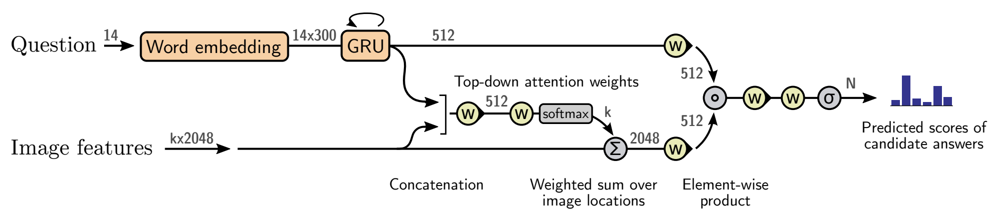

## Introduction

In recent years, computer vision has witnessed extremely rapid progress. Somewhat surprisingly, this thriving field was originated from [a summer project at MIT in 1966](https://dspace.mit.edu/handle/1721.1/6125). Richard Szeliski wrote in [Computer Vision: Algorithms and Applications](http://szeliski.org/Book/):

> in 1966, Marvin Minsky at MIT asked his undergraduate student Gerald Jay Sussman to spend the summer linking a camera to a computer and **getting the computer to describe what it saw**

This *see-and-describe* summarizes the original goal of the pioneers: let the computer see the world around it (expressed in images/videos) and describe it.

Till now, several granularities of descriptions have been developed: image-level category descriptions (image classification), object-level location descriptions (object detection), and pixel-level dense descriptions (image segmentation).

However, the most natural way to describe something (for humans) is to use *natural language*. Actually, the above story of Marvin Minsky, though often been cited as an evidence of how those masters underestimated the difficulties of vision problems, also shows that computer vision was born with an expectation of being connected with natural language.

## Current Research

Many researchers have been seeking to build the connection between computer vision and natural language, which poses a challenging modeling problem with two modalities of data (images and natural language). Nowadays, the research community has generally come to a consensus on modeling images with convolutional neural networks (CNNs) and natural language with recurrent neural networks (RNNs). Both of these architectures can be made deeper by adding layers with homogeneous computations for better performance. Specifically, researchers have tried to build the connection between vision and natural language in the following ways.

### Image/Video Captioning

In image/video captioning, an image/video is given and a sentence describing its content is returned. In current research, the image/video is usually encoded into a feature vector by a CNN. Then an RNN generates the captions using this vector as the initial hidden state, as shown in the following two figures (taken from [Deep Visual-Semantic Alignments for Generating Image Descriptions](https://cs.stanford.edu/people/karpathy/deepimagesent/) and [Translating Videos to Natural Language Using Deep Recurrent Neural Networks](https://arxiv.org/abs/1412.4729)).

### Image Generation (from Text)

This is the inverse problem of image captioning: a sentence is given and an image matching the meaning of the sentence is returned. The recent advances of generative adversarial networks (GANs) have opened up tons of opportunities for generation tasks like this. Typically, image generation makes use of GANs with the text being encoded by an RNN and fed into the generator/discriminator networks, as shown below (taken from [Generative Adversarial Text to Image Synthesis](https://arxiv.org/abs/1605.05396)).

### Visual Question Answering

In visual question answering (VQA), an image and a question about it are given and the answer is returned. This is arguably a very natural way for humans to interact with computers. In recent years, computers have learned to answer questions like *is this a cat* (classification) or *where is the cat* (detection/segmentation). Now they are asked more questions like [counting](http://www.visualqa.org/), [spatial/logical reasoning](https://cs.stanford.edu/people/jcjohns/clevr/), and [analyzing graphical plots and figures](https://datasets.maluuba.com/FigureQA). In VQA, the visual content and the question content are often encoded by CNNs and RNNs respectively and then combined in some way to generate the answer, as shown below (taken from [Bottom-Up and Top-Down Attention for Image Captioning and Visual Question Answering](https://arxiv.org/abs/1707.07998)).

## Future Opportunities

Current research in connecting computer vision and natural language has achieved great breakthroughs thanks to the success of CNNs and RNNs in the two areas respectively. However, there are still some limitations in current research that open up future opportunities.

### Fine-grained Image Captioning
Current image captioning generates captions which give an overall description of images. The results of applying [a state-of-the-art image captioning algorithm](https://github.com/karpathy/neuraltalk2) to images from the [COCO dataset](http://cocodataset.org/) are shown below.

In the COCO dataset, images are of various scenes and objects. And the captioning algorithm is able to capture the overall content of what is happening in the image, except for some mistakes like the cat is not sitting on the laptop. But, in general, the captions are very discriminative considering the large differences between images. Given images and captions, it is very easy to tell which image corresponds to which caption. Image captioning makes great sense in this case.

Then I applied the same captioning algorithm to the [Clothing Co-Parsing (CCP) dataset](https://github.com/bearpaw/clothing-co-parsing), whose images are all clothing images. The captions are shown below.

In the CCP dataset, images are all coming from the clothing domain and thus they are very similar to each other in the overall content. And the differences are mostly reflected in fine-grained details. In this case, the captions which only capture the overall content become meaningless and are not very helpful for distinguishing one image from others. Moreover, the captions make more mistakes, like a lot of false positives of cell phones.

For classifying images in the same domain, researchers have come up with fine-grained image classification. Now to caption these images, whose fine-grained details are much more important than the overall content, it makes sense to state that we need *fine-grained image captioning*.

Similar to fine-grained image classification, which finds many applications in online advertising (like searching by images), fine-grained image captioning also finds an important application in this area, that is, to write captions for goods.

Actually, businesses are always trying to describe the attractive details of their goods to convince customers to make the buying decision. For example, the advertising captions of two clothing images in [Toutiao](http://m.toutiao.com/profile/5569547953/) are shown below.

The above captions are very different from those of the COCO and CCP datasets. Instead of merely focusing on the overall image content, they try to capture more fine-grained details of the clothes. They even go beyond those details to present customers a sense of how the clothes will look on him/her. These captions are also more flexible since they are manually written by businesses, though a mistake about the color of the dress is made in the right image. So a natural question is whether we can apply image captioning to write such captions for advertising. Obviously, general image captioning is still unable to perform well on it, as shown in the captions of the CCP dataset. So fine-grained image captioning comes into use. However, there are still very few works on it.

It is worth noting that though I am using clothing as an example domain to present fine-grained image captioning, it is definitely not limited to clothing and can also be applied to many other domains like [food](https://arxiv.org/abs/1512.02665) and [cars](http://mmlab.ie.cuhk.edu.hk/datasets/comp_cars/index.html).

To solve the fine-grained image captioning problem, the considerable number of online advertising captions serve as a good basis. The pipeline of fine-grained image captioning may also be similar to that of general image captioning: a CNN learns a domain-specific representation of the image (maybe via fine-tuning the network in a fine-grained image classification task) and then an RNN generates a fine-grained caption conditioned on the representation. There should be many problems waiting to be discovered and solved in fine-grained image captioning.
 
### Short Videos

Recent years, we have witnessed an increasing popularity of short videos. Many companies like Facebook, Instagram, [Kuaishou](https://www.kuaishou.com/), [Douyin](https://www.douyin.com/) etc. have developed products to enable their users to upload and share short videos. Compared to static images and long videos, short videos have the flexibility and authenticity of videos, and can also be as concentrated (on a topic) as static images.

For long videos (like movies), they contain much more information than what several sentences can describe, which poses challenges to video captioning. And they have a relatively large and non-trivial search space for visual question answering. Given the large number of short videos, a moderate next step is to work on these tasks using short videos.

Modeling short videos can be done by combing CNNs and RNNs: each frame can be modeled by a CNN and the sequence of frames is well suited for an RNN. On the way to connect computer vision and natural language, short videos act as a good transition state between static images and long videos. And their popularity provides a lot of applications in recommendation, structured analysis, etc. Successful modeling of short videos will also be helpful to long videos since long videos can be treated as a sequence of relatively short videos (shots).

## Conclusions

Computer vision has been expected to be connected with natural language since born. And humans are good at both of these tasks. So an intelligent agent in the future should preferably have these two kinds of abilities. However, the two areas present two modalities of data, which poses a challenging modeling problem. In recent years, the success of CNNs and RNNs has solved the modeling problem much better than ever before. Based on these homogeneous network architectures, breakthroughs have already been achieved in tasks like image/video captioning, image generation and visual question answering, which all seek to build the connection in some way. These advancements open up more opportunities, like fine-grained image captioning for online advertising and modeling short videos. And efforts spent on solving these problems will become the next  ``small step" to enable the computer to describe what it sees.

## Further Reading

If you find this topic (connecting computer vision and natural image) interesting to you, I strongly recommend you to read Andrej Karpathy's PhD thesis - [Connecting Images and Natural Language](https://cs.stanford.edu/people/karpathy/main.pdf). Actually the title of this blog post is inspired by his thesis.