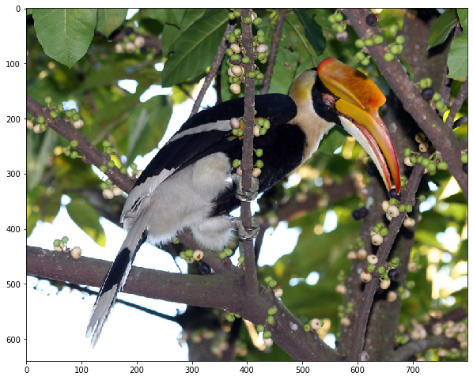
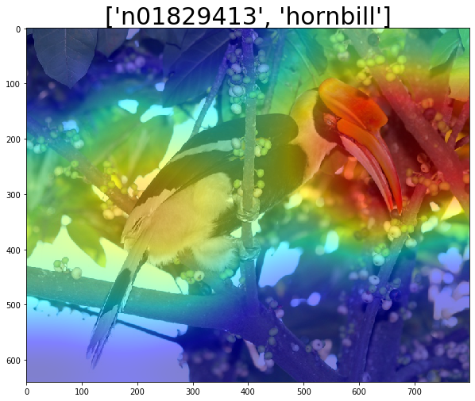

While deep neural networks have achieved state-of-the-art performance in many problems(e.g., image classification, object detection, scene parsing etc.), it is always not trivial to intepret their outputs. Till now, the most common and useful way to interpret the output of a deep neural network is still by visualization. You may refer to this [CS231n course note](http://cs231n.github.io/understanding-cnn/) for some introduction.

In this post, I will describe how to interpret an image classification model using [Captum](https://captum.ai/). Captum, which means "comprehension" in Latin, is a open-source project with many model interpretabiliy algorithms implemented in PyTorch. Specifically, I adopted [`LayerGradCam`](https://github.com/pytorch/captum/blob/master/captum/attr/_core/layer/grad_cam.py#L21) for this post.

## Install Captum
As `LayerGradCam` is still not released at the time of writing this post, to use it, clone the Captum repository locally and install it from there.

```shell
git clone git@github.com:pytorch/captum.git
cd captum
pip install -e .
```

Then import all the required packages.

```python
import json
import requests

from io import BytesIO

import cv2
import numpy as np

import torch
from torchvision import models, transforms

from PIL import Image

import matplotlib.pyplot as plt
%matplotlib inline

from captum.attr import LayerAttribution, LayerGradCam
```

## Prepare a Model and an Image
I use the [`MobileNetV2`](https://github.com/pytorch/vision/blob/master/torchvision/models/mobilenet.py#L72) pretrained on ImageNet from `torchvision` and an image of a Hornbill from [Wikipedia](https://upload.wikimedia.org/wikipedia/commons/8/8f/Buceros_bicornis_%28female%29_-feeding_in_tree-8.jpg). Later I will use `LayerGradCam` to intepret and visualize why the model gives the specific output for this image.

Note that the model needs to be set to the test mode.

```python
# use MobileNetV2
model = models.mobilenet_v2(pretrained=True)
model = model.eval()
```

For the image, I first read its encoded string from its URL and then use the `PIL.Image` format to decode it. In this way, the channels of the image are in the RGB order.

```python
img_url = 'https://upload.wikimedia.org/wikipedia/commons/8/8f/Buceros_bicornis_%28female%29_-feeding_in_tree-8.jpg'
resp = requests.get(img_url)
img = Image.open(BytesIO(resp.content))
plt.figure(figsize=(10, 10))
plt.imshow(img)
```

<div style="text-align:center"></div>

I also prepare the class names for the 1000 classes in ImageNet. This will let me know the specific class names instead of only the index of the predicted class. The class names are loaded from the following URL.

```python
url = 'https://s3.amazonaws.com/deep-learning-models/image-models/imagenet_class_index.json'
resp = requests.get(url)
class_names_map = json.loads(resp.text)
```

## Preprocessing

For `torchvision` models, before passing an image to it, the image needs to be applied the following preprocessing ([reference](https://github.com/pytorch/vision/issues/39#issuecomment-403701432)). This is a key step to make the model run on images from the same distribution as of those that it was trained on.

```python
preprocessing = transforms.Compose([
    transforms.Resize(256),
    transforms.CenterCrop(224),
    transforms.ToTensor(),
    transforms.Normalize(
        mean=[0.485, 0.456, 0.406],
        std=[0.229, 0.224, 0.225]
    ),
])
```

## LayerGradCam

Now we can apply `LayerGradCam` to "attribute" the output of the model to a specific layer of the model. What `LayerGradCam` does is basically computing the gradients of the output with respect to that specific layer. The following function is used to get a layer from the model by its name.

```python
def get_layer(model, layer_name):
    for name in layer_name.split("."):
        model = getattr(model, name)
    return model
```

The `features.18` layer of MobileNetV2 will be used in this notebook.

```python
layer = get_layer(model, 'features.18')
```

We will use `LayerGradCam` to compute the attribution map (gradients) of the model's top-1 output with respect to `layer`. This map can be interpreted as to what extent is the output influenced by a unit in `layer`. This makes sense as the larger the gradient, the larger the influence.

This attribution map (with the same size as the output of `layer`, in this case, 7*7) is further upsampled to the size of the image and overlaid on the image as a heatmap. So this heatmap reflects how much influence each pixel has on the output of the model. The pixels with larger influence (the red regions in the heatmap) can thus be interpreted as the main regions in the image that drive the model to generate its output.

To enable all above processing of the attribution map, two functions are implemented as follows. The first function `to_gray_image` converts an `np.array` to a gray-scale image by normalizing its values to `[0, 1]`, multiplying it by 255, and converting its data type to `uint8`. The second one `compute_heatmap` utilizes `cv2` to overlay a `torch.Tensor` as a heatmap on an image.

```python
def to_gray_image(x):
    x -= x.min()
    x /= x.max() + np.spacing(1)
    x *= 255
    return np.array(x, dtype=np.uint8)
```

```python
def overlay_heatmap(img, grad):
    # convert PIL Image to numpy array
    img_np = np.array(img)
    # convert gradients to heatmap
    grad = grad.squeeze().detach().numpy()
    grad_img = to_gray_image(grad)
    heatmap = cv2.applyColorMap(grad_img, cv2.COLORMAP_JET)
    heatmap = heatmap[:, :, ::-1] # convert to rgb
    # overlay heatmap on image
    return cv2.addWeighted(img_np, 0.5, heatmap, 0.5, 0)
```

In `overlay_heatmap`, note that `img` is in RGB order while the `heatmap` returned by `cv2.applyColorMap` is in BGR order. So we convert `heatmap` to RGB order first before the overlay.

Using all above functions, the following function `attribute` computes and overlays the `LayerGradCam` heatmap on an image.

```python
def attribute(img):
    # preprocess the image
    preproc_img = preprocessing(img)
    # forward propagation to get the model outputs
    inp = preproc_img.unsqueeze(0)
    out = model(inp)
    # construct LayerGradCam
    layer_grad_cam = LayerGradCam(model, layer)
    # generate attribution map
    _, out_index = torch.topk(out, k=1)
    out_index = out_index.squeeze(dim=1)
    attr = layer_grad_cam.attribute(inp, out_index)
    upsampled_attr = LayerAttribution.interpolate(attr, (img.height, img.width), 'bicubic')
    # generate heatmap
    heatmap = overlay_heatmap(img, upsampled_attr)
    return heatmap, out_index.item()
```

Specifically, what `attribute` does is as follows.

1. Preprocess the image;
2. Run a forward propagation on the image to get the model's output;
3. Construct a `LayerGradCam` object using `model` and `layer`;
4. Generate the attribution map of the model's top-1 output to `layer`;
5. Upsample the attribution map to the same size as the image;
6. Overlay the attribution map as a heatmap on the image.

Now it is time to run an example! Let's see what class the `model` predicts on the Hornbill image, and more importantly, why.

```
vis, out_index = attribute(img)
fig = plt.figure(figsize=(10, 10))
ax = fig.add_subplot(111)
ax.set_title(class_names_map[str(out_index)], fontsize=30)
plt.imshow(vis)
```

<div style="text-align:center"></div>

We can see that the model makes a correct prediction. From the above visualization, we can also see that the red regions are mostly around the head and beak of the Hornbill, especiall its heavy bill. The red regions are the main regions that drive the model to generate its output. This makes great sense as those regions are just the distinctive features of a Hornbill.

Now you can also apply the above technique (and more from Captum) to interpret the output of your PyTorch model. Have fun!

**Notes:** This post is alao avaialble as a [Jupyter notebook](https://gist.github.com/jianchao-li/f7b507bc66b2215e15cc0135f03c3ff9).